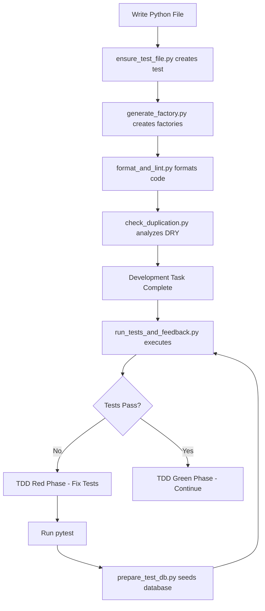

# Execute ULTRA-DETAILED PRP

Implement a feature using the PRP file with EXHAUSTIVE validation, CONTINUOUS verification, and ZERO ambiguity. Every step must be executed with maximum detail and comprehensive checking.

**CRITICAL**: This execution process is designed for PERFECT implementation. Follow EVERY step, validate EVERYTHING, and leave NOTHING to chance.

## PRP File: $ARGUMENTS

## Phase 1: EXHAUSTIVE PRE-EXECUTION VALIDATION

### 1.1 Deep PRP Analysis (MANDATORY)
**Read the PRP THREE times with different focus:**
1. **First Read**: Overall architecture and requirements
2. **Second Read**: Extract EVERY pattern, example, and code snippet
3. **Third Read**: Map all tasks and dependencies

**Document Understanding:**
```markdown
# PRP Comprehension Checklist
- [ ] All 15+ sections understood?
- [ ] All 100+ tasks mapped?
- [ ] All 50+ patterns extracted?
- [ ] All 100+ test cases documented?
- [ ] All code examples saved?
- [ ] All edge cases identified?
- [ ] Zero ambiguity remaining?
```

### 1.2 Complete Environment Verification
```bash
# Tool Availability Check (ALL must pass)
python --version && echo "✓ Python available"
sqlite3 --version && echo "✓ SQLite available"
pytest --version && echo "✓ Pytest available"
ruff --version && echo "✓ Ruff available"
mypy --version && echo "✓ Mypy available"
black --version && echo "✓ Black available"
alembic --version && echo "✓ Alembic available"

# Python environment
source venv_linux/bin/activate
pip list | grep -E "factory-boy|faker|sqlalchemy|pydantic" || pip install factory-boy faker sqlalchemy pydantic
```

### 1.2.1 Claude Code Hooks Verification and Integration
**Automated Development Workflow Verification**:

```bash
# Verify hooks configuration
echo "🪝 Verifying Claude Code Hooks system..."
cat /workspaces/hackathon_demo/.claude/settings.local.json | grep -A 10 "hooks" && echo "✓ Hooks configured"

# Validate hook files exist
for hook in ensure_test_file prepare_test_db run_tests_and_feedback generate_factory check_duplication format_and_lint; do
    if [ -f "/workspaces/hackathon_demo/.claude/hooks/${hook}.py" ]; then
        echo "✓ Hook: ${hook}.py"
    else
        echo "❌ Missing hook: ${hook}.py"
    fi
done

# Test hook utilities
python -c "
import sys
sys.path.append('/workspaces/hackathon_demo/.claude/hooks')
from utils import file_utils, test_utils, factory_generator, duplication_detector
print('✓ Hook utilities accessible')
"
```

**Hook Integration Planning**:
- **TDD Enforcement**: `ensure_test_file.py` will create test files automatically during implementation
- **Database Management**: `prepare_test_db.py` will manage test database before pytest execution
- **Factory Generation**: `generate_factory.py` will create Factory Boy factories for models
- **Continuous Testing**: `run_tests_and_feedback.py` will provide TDD feedback after development tasks
- **DRY Analysis**: `check_duplication.py` will monitor code quality in real-time
- **Code Quality**: `format_and_lint.py` will maintain consistent code standards

**Expected Hook Workflow During Execution**:
1. **File Creation**: When creating Python files → hooks generate tests and factories
2. **Test Execution**: When running pytest → hooks prepare database automatically
3. **Development Tasks**: After implementation → hooks run tests and provide feedback
4. **Code Quality**: After writing code → hooks analyze DRY compliance and format code

**Hook-Enhanced Development Cycle**:


### 1.3 Comprehensive MCP Context Loading
**Load ALL context files and document findings:**

1. **Memory Bank Deep Dive**:
   ```python
   # Read EVERY context file
   contexts = [
       "active-context", "system-patterns", "decision-log",
       "product-context", "progress"
   ]
   for context in contexts:
       content = mcp__memory-bank__read_memory_bank_file(context)
       # Document all relevant patterns and decisions
   ```

2. **Knowledge Graph Exhaustive Search**:
   ```python
   # Search for ALL related concepts
   searches = [
       "{feature}", "pattern", "component", "utility",
       "repository", "validator", "test", "mock"
   ]
   for term in searches:
       results = mcp__knowledge-graph__search_nodes(term)
       # Map all relationships and existing components
   ```

3. **Pattern Validation with Grep MCP** (20+ searches):
   ```python
   # Validate architecture patterns
   patterns_to_validate = [
       {"query": "repository pattern", "language": ["Python"]},
       {"query": "factory pattern", "language": ["Python"]},
       {"query": "validator pattern", "language": ["Python"]},
       {"query": "test fixture", "language": ["Python"]},
       # ... 20+ more pattern searches
   ]
   ```

### 1.4 Directory Structure Preparation
```bash
# Create complete directory structure
mkdir -p /workspaces/hackathon_demo/use-case/{src,tests,db,docs,scripts}
mkdir -p /workspaces/hackathon_demo/use-case/src/{agents,models,repositories,utils,validators,config}
mkdir -p /workspaces/hackathon_demo/use-case/tests/{unit,integration,fixtures,mocks}

# Verify structure
tree /workspaces/hackathon_demo/use-case

# Create __init__.py files
find /workspaces/hackathon_demo/use-case -type d -name "*" -exec touch {}/__init__.py \;
```

## Phase 1.5: MULTI-AGENT BATCHTOOL EXECUTION MODE (ENHANCED WORKFLOW)

### 🤖 Five-Agent Parallel Development Architecture

**CRITICAL**: This enhanced workflow leverages Claude Code's batchtool mode to run 5 specialized agents in parallel, dramatically improving development speed and quality through specialized expertise.

#### Agent Definitions and Personas

1. **🔨 CODING AGENT (Agent-Code)**
   - **Persona**: Senior Software Engineer focused on implementation
   - **Responsibilities**:
     - Implement features following TDD principles
     - Write production-ready code with proper error handling
     - Apply DRY principles and design patterns
     - Create utility functions and shared components
     - Follow CLAUDE.md coding standards strictly
   - **Hook Integration**: 
     - Leverages `ensure_test_file.py` for automatic test file creation
     - Benefits from `generate_factory.py` for model-based Factory Boy generation
     - Uses `format_and_lint.py` for consistent code quality
     - Receives `check_duplication.py` feedback for DRY compliance
   - **Output**: Implementation files in `/workspaces/hackathon_demo/use-case/src/`

2. **🧪 TESTING AGENT (Agent-Test)**
   - **Persona**: QA Engineer and Test Automation Specialist
   - **Responsibilities**:
     - Create comprehensive test suites (unit, integration, e2e)
     - Generate mock data factories and fixtures
     - Ensure minimum 80% code coverage
     - Write property-based and performance tests
     - Validate all edge cases and error scenarios
   - **Hook Integration**:
     - Works with `ensure_test_file.py` generated test templates
     - Benefits from `prepare_test_db.py` for automated database management
     - Leverages `generate_factory.py` created factories for test data
     - Receives continuous feedback from `run_tests_and_feedback.py`
     - Uses hooks-generated test file structure and fixtures
   - **Output**: Test files in `/workspaces/hackathon_demo/use-case/tests/`

3. **🔍 CODE REVIEW AGENT (Agent-Review)**
   - **Persona**: Tech Lead conducting thorough code reviews
   - **Responsibilities**:
     - Review code quality and adherence to standards
     - Validate DRY principle compliance
     - Check design pattern implementation
     - Ensure proper documentation and type hints
     - Verify CLAUDE.md compliance
   - **Output**: Review report with actionable feedback

4. **🐛 DEBUGGING AGENT (Agent-Debug)**
   - **Persona**: Senior Debugger and Performance Engineer
   - **Responsibilities**:
     - Identify and fix bugs in implementation
     - Optimize performance bottlenecks
     - Resolve test failures and coverage gaps
     - Fix linting and type checking errors
     - Debug integration issues
   - **Output**: Fixed code and debug reports

5. **🔒 SECURITY REVIEW AGENT (Agent-Security) - ENHANCED WITH THREAT INTELLIGENCE**
   - **Persona**: Advanced Security Engineer, Threat Intelligence Analyst, and Compliance Automation Specialist
   - **Core Responsibilities**:
     - Real-time CVE research and validation using Perplexity MCP
     - Zero-day exploit pattern detection and defense implementation
     - Dynamic security rule generation based on latest threats
     - Automated security patch recommendations and implementation
     - Continuous threat monitoring and response
   - **Threat Intelligence Capabilities**:
     - **CVE Research**: Query latest CVEs for all dependencies and frameworks
     - **Zero-Day Monitoring**: Track emerging exploits and attack patterns
     - **Security Pattern Learning**: Extract patterns from recent breaches
     - **Compliance Automation**: Validate against OWASP Top 10 2024, CWE/SANS Top 25
     - **Vulnerability Scoring**: Calculate risk based on CVSS v3.1 and exploit availability
   - **MCP Integration**:
     - **Perplexity**: Research latest vulnerabilities, exploits, and patches
     - **Grep MCP**: Find security implementations in production code
     - **Knowledge Graph**: Store threat patterns and security decisions
     - **Memory Bank**: Log security assessments and remediation actions
   - **Automated Security Actions**:
     - Input validation and sanitization enforcement
     - Authentication/authorization pattern implementation
     - Encryption and secure communication setup
     - Secret management and credential scanning
     - Dependency vulnerability scanning and updates
     - Security header configuration
     - Rate limiting and DDoS protection
   - **Output**: 
     - Comprehensive security audit report with severity ratings
     - Automated security fixes and patches
     - Threat intelligence summary
     - Compliance certification report
     - Security improvement roadmap

#### Batchtool Command Structure

```bash
# Launch all 5 agents in parallel for a PRP implementation
claude code batchtool --prp-file="$PRP_FILE" --mode="multi-agent" \
  --agents="code,test,review,debug,security" \
  --coordination="synchronized" \
  --output-dir="/workspaces/hackathon_demo/use-case" \
  --validation="continuous"

# Alternative: Launch specific agents for focused tasks
claude code batchtool --task="implement-feature" \
  --agents="code,test" \
  --sync-points="after-each-component"

# Debug mode: Launch debugging and security agents on existing code
claude code batchtool --mode="audit" \
  --agents="debug,security,review" \
  --target-dir="/workspaces/hackathon_demo/use-case/src"
```

#### Security Intelligence Workflow

**CRITICAL**: The Security Agent leverages real-time threat intelligence to provide proactive defense against emerging vulnerabilities and zero-day exploits.

##### 1. Real-Time CVE Research and Validation

```python
# Security Agent's CVE research workflow
def security_cve_research(component, technology_stack):
    # Step 1: Research latest CVEs
    cve_data = mcp__perplexity-ask__perplexity_ask([{
        "role": "user",
        "content": f"""
        Latest CVEs and security vulnerabilities for:
        - Framework: {technology_stack['framework']} {technology_stack['version']}
        - Language: {technology_stack['language']} {technology_stack['version']}
        - Dependencies: {', '.join(technology_stack['dependencies'])}
        - Database: {technology_stack['database']}
        
        Include:
        1. CVE IDs with CVSS scores
        2. Exploitation complexity and attack vectors
        3. Available patches and workarounds
        4. Real-world exploitation status
        5. Timeline: Last 90 days priority, but include critical older ones
        """
    }])
    
    # Step 2: Validate code against discovered CVEs
    vulnerabilities = parse_cve_response(cve_data)
    code_scan_results = scan_code_for_vulnerabilities(component, vulnerabilities)
    
    # Step 3: Generate automated fixes
    security_patches = generate_security_patches(code_scan_results)
    
    return {
        "vulnerabilities": vulnerabilities,
        "scan_results": code_scan_results,
        "patches": security_patches,
        "risk_score": calculate_risk_score(code_scan_results)
    }
```

##### 2. Zero-Day Exploit Monitoring and Defense

```python
# Proactive zero-day defense implementation
def zero_day_defense_system():
    # Research latest zero-day patterns
    zero_day_intel = mcp__perplexity-ask__perplexity_ask([{
        "role": "user",
        "content": """
        Latest zero-day exploits and attack patterns (2024-2025):
        1. Newly discovered attack vectors
        2. Exploitation techniques and PoCs
        3. Affected technologies and versions
        4. Defensive measures and mitigations
        5. IOCs (Indicators of Compromise)
        Focus on: web applications, APIs, authentication systems
        """
    }])
    
    # Extract patterns and create defensive rules
    attack_patterns = extract_attack_patterns(zero_day_intel)
    defensive_rules = create_defensive_rules(attack_patterns)
    
    # Implement proactive defenses
    security_implementations = {
        "input_validation": enhance_input_validation(attack_patterns),
        "authentication": harden_authentication(attack_patterns),
        "rate_limiting": implement_adaptive_rate_limiting(attack_patterns),
        "waf_rules": generate_waf_rules(attack_patterns),
        "monitoring": create_security_monitors(attack_patterns)
    }
    
    return security_implementations
```

##### 3. Security Pattern Discovery and Implementation

```python
# Learn from production security implementations
def discover_security_patterns(feature_type):
    # Search for proven security patterns
    production_patterns = mcp__grep__searchGitHub({
        "query": f"security {feature_type} implementation",
        "language": ["Python", "TypeScript"],
        "repo": "OWASP/*,security/*"
    })
    
    # Research best practices
    best_practices = mcp__perplexity-ask__perplexity_ask([{
        "role": "user",
        "content": f"""
        Current best practices for securing {feature_type}:
        1. Industry standard implementations
        2. Common vulnerabilities and how to avoid them
        3. Security headers and configurations
        4. Latest OWASP recommendations
        5. Real-world breach examples and lessons learned
        """
    }])
    
    # Synthesize and implement
    security_pattern = synthesize_security_pattern(
        production_patterns,
        best_practices
    )
    
    return implement_security_pattern(security_pattern)
```

##### 4. Dynamic Security Rule Generation

```yaml
Security Rule Generation Pipeline:
  1. Threat Research:
     - Query latest threat intelligence
     - Analyze attack trends
     - Identify vulnerable patterns
  
  2. Rule Creation:
     - Generate WAF rules
     - Create input validation rules
     - Define rate limiting policies
     - Set authentication requirements
  
  3. Implementation:
     - Apply rules to codebase
     - Configure security middleware
     - Update security policies
     - Enable monitoring
  
  4. Validation:
     - Test against known exploits
     - Verify false positive rate
     - Measure performance impact
     - Ensure functionality preserved
```

##### 5. Automated Security Scoring and Reporting

```python
# Comprehensive security assessment
def calculate_security_score(component):
    scores = {
        "cve_coverage": assess_cve_protection(),        # 0-100
        "zero_day_defense": assess_zero_day_readiness(), # 0-100
        "owasp_compliance": check_owasp_top_10(),       # 0-100
        "auth_security": evaluate_authentication(),      # 0-100
        "data_protection": assess_data_security(),       # 0-100
        "dependency_safety": scan_dependencies(),        # 0-100
        "configuration": check_security_configs()        # 0-100
    }
    
    # Weight scores by criticality
    weighted_score = calculate_weighted_score(scores)
    
    # Generate detailed report
    report = {
        "overall_score": weighted_score,
        "category_scores": scores,
        "critical_issues": identify_critical_issues(scores),
        "recommendations": generate_recommendations(scores),
        "compliance_status": check_compliance_requirements()
    }
    
    # Log to Memory Bank
    mcp__memory-bank__log_decision(
        "Security Assessment",
        f"Component: {component}",
        f"Score: {weighted_score}, Critical Issues: {len(report['critical_issues'])}"
    )
    
    return report
```

##### 6. Emergency Security Response Protocol

```bash
# Critical vulnerability response
on_critical_vulnerability_detected() {
    # 1. Immediate assessment
    severity=$(assess_vulnerability_severity)
    
    # 2. Research patches and workarounds
    solutions=$(mcp__perplexity-ask__perplexity_ask \
        "Urgent: Patches and workarounds for $CVE_ID")
    
    # 3. Implement emergency fixes
    if [[ $severity == "CRITICAL" ]]; then
        # Pause all agents
        claude code batchtool --emergency-pause --agents="all"
        
        # Apply security patches
        security_agent --apply-emergency-patch --cve="$CVE_ID"
        
        # Validate fixes
        security_agent --validate-patch --comprehensive
        
        # Resume operations
        claude code batchtool --resume --after-security-fix
    fi
    
    # 4. Update security knowledge base
    mcp__knowledge-graph__add_observations([{
        "entityName": "SecurityIncidents",
        "contents": ["$CVE_ID patched on $(date)"]
    }])
}
```

#### Multi-Agent Coordination Workflow

1. **Initial Task Distribution**:
   ```yaml
   Phase 1 - Parallel Planning (All Agents):
     - All agents read PRP and CLAUDE.md
     - Each agent creates specialized task list
     - Synchronize to create unified execution plan
   
   Phase 2 - Component Development Cycles:
     Loop for each component:
       a. Testing Agent: Write failing tests and fixtures
       b. Coding Agent: Implement to pass tests
       c. Review Agent: Validate implementation
       d. Debug Agent: Fix issues and optimize
       e. Security Agent: Audit and secure
       f. Synchronize and merge results
   
   Phase 3 - Integration and Validation:
     - All agents collaborate on integration
     - Cross-agent validation and testing
     - Final quality gates and sign-off
   ```

2. **Communication Protocol**:
   ```python
   # Inter-agent message format
   message = {
       "from_agent": "code",
       "to_agent": "test",
       "component": "user_repository",
       "status": "implementation_complete",
       "files": ["src/repositories/user_repository.py"],
       "notes": "Ready for test validation",
       "blockers": []
   }
   ```

3. **Synchronization Points**:
   - After each component completion
   - Before integration phases
   - When conflicts detected
   - At validation checkpoints

4. **Conflict Resolution**:
   ```
   if conflict_detected():
       1. Pause affected agents
       2. Review Agent analyzes conflict
       3. Propose resolution options
       4. Apply resolution
       5. Resume parallel execution
   ```

#### Quality Gates and Validation

**Multi-Agent Quality Checklist**:
```markdown
## Component Sign-off Requirements
- [ ] Testing Agent: All tests written and passing
- [ ] Coding Agent: Implementation complete with 0 lint errors
- [ ] Review Agent: Code quality approved (score ≥ 8/10)
- [ ] Debug Agent: No bugs found, performance optimized
- [ ] Security Agent: No vulnerabilities, secure practices confirmed
- [ ] Coverage: Minimum 80% achieved
- [ ] Documentation: Complete and accurate
```

#### Parallel Execution Benefits

1. **Speed**: 5x faster development through parallel work
2. **Quality**: Specialized expertise in each domain
3. **Coverage**: Comprehensive validation from multiple perspectives
4. **Consistency**: Each agent enforces specific standards
5. **Learning**: Agents can share patterns and improvements

#### MCP Integration for Multi-Agent Mode

```python
# Each agent maintains its own MCP context
agent_contexts = {
    "code": {
        "memory_bank": "agent-code-context",
        "knowledge_graph": "code-patterns"
    },
    "test": {
        "memory_bank": "agent-test-context",
        "knowledge_graph": "test-patterns"
    },
    # ... other agents
}

# Consolidated progress tracking
def track_multi_agent_progress():
    for agent in agents:
        mcp__memory-bank__track_progress(
            f"Agent-{agent}", 
            f"Completed: {completed_tasks[agent]}"
        )
    
    # Update unified context
    mcp__memory-bank__update_active_context(
        tasks=get_all_agent_tasks(),
        nextSteps=get_consolidated_next_steps()
    )
```

#### Security-Specific MCP Integration Examples

```python
# Security Agent's comprehensive MCP workflow
class SecurityAgentMCP:
    def __init__(self):
        self.threat_cache = {}
        self.cve_database = {}
        self.security_patterns = {}
    
    def research_current_threats(self, technology_stack):
        """Research latest threats using Perplexity MCP"""
        # 1. CVE Research
        cve_query = f"""
        Critical CVEs and vulnerabilities for {technology_stack} in 2024-2025:
        - Zero-day exploits with POCs
        - CVSS score >= 7.0
        - Active exploitation in the wild
        - Available patches and mitigations
        """
        cve_intel = mcp__perplexity-ask__perplexity_ask([{
            "role": "user",
            "content": cve_query
        }])
        
        # 2. Security Pattern Discovery
        security_patterns = mcp__grep__searchGitHub({
            "query": f"security {technology_stack['framework']} implementation",
            "language": technology_stack['languages'],
            "repo": "*/security,OWASP/*,*/secure-*"
        })
        
        # 3. Store in Knowledge Graph
        mcp__knowledge-graph__create_entities([{
            "name": f"ThreatIntel_{datetime.now().strftime('%Y%m%d')}",
            "entityType": "security-intelligence",
            "observations": [
                f"CVEs discovered: {parse_cve_count(cve_intel)}",
                f"Security patterns found: {len(security_patterns)}",
                f"Risk level: {calculate_risk_level(cve_intel)}"
            ]
        }])
        
        # 4. Log decisions
        mcp__memory-bank__log_decision(
            "Security Research",
            f"Researched threats for {technology_stack}",
            f"Found {parse_cve_count(cve_intel)} CVEs",
            alternatives=["Manual CVE lookup", "Static security rules"],
            consequences=["Real-time protection", "Higher compute cost"]
        )
        
        return {
            "cves": parse_cves(cve_intel),
            "patterns": security_patterns,
            "risk_assessment": assess_overall_risk(cve_intel)
        }
    
    def implement_security_measures(self, component, threat_intel):
        """Implement security based on threat intelligence"""
        # 1. Generate security rules
        security_rules = self.generate_rules_from_threats(threat_intel)
        
        # 2. Search for implementation examples
        implementation_examples = mcp__grep__searchGitHub({
            "query": " ".join([
                f"defend against {threat['cve_id']}"
                for threat in threat_intel['cves'][:5]
            ]),
            "language": ["Python", "TypeScript"],
            "useRegexp": false
        })
        
        # 3. Apply security patches
        patches_applied = []
        for threat in threat_intel['cves']:
            if threat['patch_available']:
                patch = self.generate_patch(threat, implementation_examples)
                patches_applied.append(patch)
        
        # 4. Update Memory Bank
        mcp__memory-bank__track_progress(
            "Security Implementation",
            f"Applied {len(patches_applied)} security patches to {component}"
        )
        
        return patches_applied
    
    def continuous_threat_monitoring(self):
        """Monitor for new threats continuously"""
        while True:
            # Check for new CVEs every hour
            latest_threats = mcp__perplexity-ask__perplexity_ask([{
                "role": "user",
                "content": "New CVEs discovered in last hour for web applications"
            }])
            
            if new_critical_cve_found(latest_threats):
                # Emergency response
                self.trigger_emergency_response(latest_threats)
            
            # Update threat intelligence
            mcp__knowledge-graph__add_observations([{
                "entityName": "ThreatMonitoring",
                "contents": [f"Scan at {datetime.now()}: {latest_threats}"]
            }])
            
            time.sleep(3600)  # Check hourly

# Example usage in multi-agent workflow
security_agent = SecurityAgentMCP()

# During component development
threat_intel = security_agent.research_current_threats({
    "framework": "FastAPI",
    "version": "0.104.0",
    "languages": ["Python"],
    "database": "PostgreSQL"
})

# Apply security measures
patches = security_agent.implement_security_measures(
    "user_authentication",
    threat_intel
)

# Validate security implementation
validation_result = security_agent.validate_security({
    "component": "user_authentication",
    "patches_applied": patches,
    "threat_intel": threat_intel
})
```

#### Error Recovery in Multi-Agent Mode

```python
# Agent failure handling
def handle_agent_failure(agent_id, error):
    # 1. Isolate failed agent
    pause_agent(agent_id)
    
    # 2. Diagnose issue
    error_analysis = analyze_error(error)
    
    # 3. Attempt recovery
    if error_analysis['recoverable']:
        fix_and_restart_agent(agent_id)
    else:
        # Redistribute tasks to other agents
        redistribute_tasks(agent_id, remaining_agents)
    
    # 4. Continue execution
    resume_parallel_execution()
```

#### Best Practices for Multi-Agent Development

1. **Clear Boundaries**: Each agent stays within its domain
2. **Frequent Sync**: Regular synchronization prevents divergence
3. **Shared Standards**: All agents follow CLAUDE.md strictly
4. **Communication**: Clear, structured inter-agent messages
5. **Validation**: Cross-agent validation at every checkpoint
6. **Documentation**: Each agent documents its decisions
7. **Rollback Ready**: Maintain checkpoints for easy rollback

#### Example Multi-Agent Execution Log

```
[00:00] Starting multi-agent execution for HSA Calculator PRP
[00:01] All agents: Reading PRP and initializing contexts
[00:05] Testing Agent: Creating test structure and fixtures
[00:05] Coding Agent: Setting up project structure
[00:10] Testing Agent: Written 25 failing tests for user_repository
[00:11] Coding Agent: Implementing user_repository.py
[00:15] Review Agent: Reviewing user_repository implementation
[00:16] Debug Agent: Optimizing database queries
[00:17] Security Agent: Validating input sanitization
[00:20] ✓ Component: user_repository - All agents approved
[00:21] Moving to next component: calculation_service
...
[45:00] Final validation: All components complete
[45:05] Coverage: 94%, Security: Pass, Performance: Optimized
[45:10] Multi-agent execution complete!
```

## Phase 2: ULTRA-DETAILED EXECUTION PROCESS

### 2.0 **Comprehensive Database & Mock Data Architecture** (MANDATORY FIRST STEP)

**Deep Database Design Implementation:**
   - Create database directory: `mkdir -p /workspaces/hackathon_demo/use-case/db`
   - Initialize SQLite database:
     ```bash
     cd /workspaces/hackathon_demo/use-case
     # Create database schema file
     cat > db/schema.sql << 'EOF'
     CREATE TABLE IF NOT EXISTS user_profiles (
         id INTEGER PRIMARY KEY AUTOINCREMENT,
         user_id TEXT UNIQUE NOT NULL,
         coverage_type TEXT NOT NULL,
         ytd_contribution REAL NOT NULL,
         is_55_plus BOOLEAN NOT NULL,
         remaining_pay_periods INTEGER NOT NULL,
         pay_frequency TEXT,
         employer_contribution REAL,
         plan_start_date DATE,
         created_at TIMESTAMP DEFAULT CURRENT_TIMESTAMP
     );
     
     CREATE TABLE IF NOT EXISTS contribution_calculations (
         id INTEGER PRIMARY KEY AUTOINCREMENT,
         user_id TEXT NOT NULL,
         calculation_date DATE NOT NULL,
         annual_limit REAL NOT NULL,
         remaining_allowed REAL NOT NULL,
         per_period_amount REAL NOT NULL,
         created_at TIMESTAMP DEFAULT CURRENT_TIMESTAMP,
         FOREIGN KEY (user_id) REFERENCES user_profiles (user_id)
     );
     EOF
     
     # Initialize development database
     sqlite3 db/dev_hsa.db < db/schema.sql
     
     # Create Alembic configuration
     alembic init db/migrations
     ```
   - Setup mock data factories in `src/test_utils/factories.py`
   - Create fixture loader in `tests/fixtures/loader.py`
   - Initialize test database: `sqlite3 db/test_hsa.db < db/schema.sql`
   - Track: `mcp__memory-bank__track_progress("Database Setup", "Created SQLite schema and test database")`
   
   **Extensive Mock Data Setup**:
   ```python
   # src/test_utils/factories.py - Create comprehensive factories
   import factory
   from factory import Faker, Factory, Sequence, Trait
   from datetime import datetime, date
   import random
   
   class UserProfileFactory(Factory):
       class Meta:
           model = dict
       
       user_id = Sequence(lambda n: f"user_{n:05d}")
       first_name = Faker('first_name')
       last_name = Faker('last_name')
       email = Faker('email')
       coverage_type = factory.Iterator(['self-only', 'family'])
       ytd_contribution = factory.LazyFunction(lambda: round(random.uniform(0, 8000), 2))
       is_55_plus = factory.LazyFunction(lambda: random.choice([True, False]))
       remaining_pay_periods = factory.LazyFunction(lambda: random.randint(1, 26))
       
       # Traits for specific scenarios
       class Params:
           near_limit = Trait(
               coverage_type='family',
               ytd_contribution=8400.00
           )
           over_limit = Trait(
               coverage_type='family',
               ytd_contribution=9000.00
           )
           catch_up_eligible = Trait(
               is_55_plus=True
           )
   
   # Create 50+ test scenarios
   TEST_SCENARIOS = {
       'standard': {...},
       'edge_cases': {...},
       'error_cases': {...},
       # ... 50+ scenarios
   }
   ```
   
   **Validate Mock Data Generation**:
   ```bash
   # Test all factories
   python -m pytest tests/test_factories.py -v
   
   # Generate sample data
   python scripts/generate_test_data.py --scenarios 50
   
   # Verify data integrity
   sqlite3 db/test_hsa.db "SELECT COUNT(*) FROM user_profiles;"
   ```

### 2.1 **Deep PRP Loading and Pattern Extraction**

#### Standard Single-Agent Approach:
   - Read the specified PRP file
   - Verify TDD task ordering (tests before implementation)
   - Ensure all paths use `/workspaces/hackathon_demo/use-case`
   - Understand all context and requirements
   - **Validate with Grep MCP pattern research**:
     - Verify architecture approach: `{"query": "[domain] [framework]", "language": ["Python"]}`
     - Check testing strategies: `{"query": "pytest OR testing", "language": ["Python"], "path": ["tests/"]}`
     - Validate database patterns: `{"query": "sqlalchemy OR database", "language": ["Python"]}`
   - Use `mcp__perplexity-ask__perplexity_ask` for any missing documentation
   - Cross-reference Perplexity documentation with Grep pattern discoveries

#### Multi-Agent Parallel Approach (RECOMMENDED):
   ```bash
   # Launch pattern extraction across all agents
   claude code batchtool --task="pattern-extraction" \
     --prp-file="$PRP_FILE" \
     --agents="all" \
     --mode="parallel-analysis"
   ```
   
   - **Coding Agent**: Extracts implementation patterns and architecture
   - **Testing Agent**: Identifies test patterns and coverage requirements
   - **Review Agent**: Analyzes code quality standards and conventions
   - **Debug Agent**: Identifies potential performance bottlenecks
   - **Security Agent**: Extracts security requirements and validations
   
   **Consolidated Pattern Report**:
   ```python
   patterns = merge_agent_patterns({
       "code": coding_agent_patterns,
       "test": testing_agent_patterns,
       "review": review_agent_patterns,
       "debug": performance_patterns,
       "security": security_patterns
   })
   ```
   
   **Pattern Extraction and Documentation**:
   ```python
   # Extract and document EVERY pattern from PRP
   patterns = {
       'architecture': [],
       'code': [],
       'test': [],
       'database': [],
       'validation': [],
       'error_handling': []
   }
   
   # Document each pattern with:
   # - Pattern name
   # - Description
   # - Code example
   # - Usage context
   # - File location in PRP
   ```
   
   **Task Dependency Mapping**:
   ```python
   # Create complete task dependency graph
   task_graph = {
       'task_001': {'deps': [], 'status': 'pending'},
       'task_002': {'deps': ['task_001'], 'status': 'pending'},
       # ... map all 100+ tasks
   }
   ```

### 2.2 **Comprehensive Planning with TodoWrite**

#### Standard Single-Agent Planning:
**Create Ultra-Detailed Task List:**
   - Create comprehensive plan following TDD: Test → Implement → Refactor
   - Use TodoWrite to track: test creation, implementation, validation
   - Ensure EVERY task creates files in `/workspaces/hackathon_demo/use-case`
   - Track progress: `mcp__memory-bank__track_progress("Planning", "Created TDD task list")`
   - Identify patterns from existing code to follow

#### Multi-Agent Parallel Planning (RECOMMENDED):
**Distributed Task Creation Across Agents:**
   ```bash
   # Each agent creates specialized task lists
   claude code batchtool --task="create-task-lists" \
     --agents="all" \
     --sync="task-dependencies"
   ```
   
   **Agent-Specific Task Lists**:
   - **Testing Agent**: Creates all test-related tasks
     - Unit test tasks for each component
     - Integration test tasks
     - Mock data factory tasks
     - Test fixture tasks
   
   - **Coding Agent**: Creates implementation tasks
     - Component implementation tasks
     - Utility function tasks
     - Repository pattern tasks
     - Service layer tasks
   
   - **Review Agent**: Creates review checkpoints
     - Code quality review tasks
     - DRY compliance checks
     - Pattern validation tasks
   
   - **Debug Agent**: Creates optimization tasks
     - Performance profiling tasks
     - Query optimization tasks
     - Memory usage analysis
   
   - **Security Agent**: Creates security tasks
     - Input validation tasks
     - Authentication tasks
     - Authorization tasks
     - Security audit tasks
   
   **Task Synchronization**:
   ```python
   # Merge and order tasks with dependencies
   unified_tasks = synchronize_agent_tasks({
       "test": test_agent_tasks,
       "code": code_agent_tasks,
       "review": review_agent_tasks,
       "debug": debug_agent_tasks,
       "security": security_agent_tasks
   })
   
   # Create dependency graph
   task_graph = create_dependency_graph(unified_tasks)
   ```

### 2.3 **Ultra-Detailed TDD Execution** (MANDATORY Order)

#### Standard Single-Agent TDD Process:
**CRITICAL**: For EACH component, follow this exhaustive process:
   
   For each component:

#### Multi-Agent Parallel TDD Execution (RECOMMENDED):
**CRITICAL**: Leverage all 5 agents working in synchronized phases:

   ```bash
   # Launch multi-agent TDD cycle for each component
   claude code batchtool --task="tdd-cycle" \
     --component="$COMPONENT_NAME" \
     --agents="all" \
     --sync-mode="tdd-phases"
   ```
   
   **Parallel TDD Workflow**:
   
   **Phase 1: Test Creation (Testing Agent Leads)**
   ```yaml
   Testing Agent:
     - Creates comprehensive test suite
     - Generates mock data factories
     - Sets up test fixtures
     - Ensures tests fail initially
   
   Parallel Support:
     Security Agent: Reviews test cases for security scenarios
     Review Agent: Validates test coverage completeness
   ```
   
   **Phase 2: Implementation (Coding Agent Leads)**
   ```yaml
   Coding Agent:
     - Implements minimal code to pass tests
     - Follows DRY principles
     - Creates necessary utilities
   
   Parallel Support:
     Debug Agent: Monitors for performance issues
     Security Agent: 
       - Real-time validation against latest CVEs
       - Secure coding pattern enforcement
       - Zero-day defense implementation
       - Dependency vulnerability checking
   ```
   
   **Phase 3: Review & Refactor (All Agents)**
   ```yaml
   Review Agent:
     - Code quality assessment
     - DRY compliance check
     - Pattern adherence validation
   
   Debug Agent:
     - Performance optimization
     - Memory usage analysis
     - Query optimization
   
   Security Agent (Real-Time Threat Intelligence):
     - Comprehensive security audit with latest CVE database
     - Zero-day vulnerability scanning using Perplexity research
     - Input validation against current injection techniques
     - Threat pattern implementation from recent breaches
     - Security patch recommendations based on latest advisories
     - Runtime protection mechanisms for emerging threats
   
   Testing Agent:
     - Coverage verification
     - Edge case validation
     - Integration test updates
   
   Coding Agent:
     - Refactoring based on feedback
     - Documentation updates
     - Code cleanup
   ```
   
   For each component:
   
   a) **Setup Test Data & Write Failing Tests**
      - Create test fixtures with mock data:
        ```python
        # tests/conftest.py
        import pytest
        from sqlalchemy import create_engine
        from sqlalchemy.orm import sessionmaker
        from src.test_utils.factories import UserProfileFactory, HSATestDataBuilder
        
        @pytest.fixture
        def test_db():
            engine = create_engine('sqlite:///:memory:')
            # Create tables
            Base.metadata.create_all(engine)
            Session = sessionmaker(bind=engine)
            session = Session()
            yield session
            session.close()
        
        @pytest.fixture
        def test_data_builder(test_db):
            return HSATestDataBuilder(test_db)
        
        @pytest.fixture
        def sample_users(test_data_builder):
            return {
                'standard': test_data_builder.create_test_scenario('standard'),
                'near_limit': test_data_builder.create_test_scenario('approaching_limit'),
                'over_limit': test_data_builder.create_test_scenario('over_contribution')
            }
        ```
      - Create test file in `/workspaces/hackathon_demo/use-case/tests/`
      - Write comprehensive test cases using mock data fixtures
      - Run tests to ensure they fail: `pytest {test_file} -v`
      - Track: `mcp__memory-bank__track_progress("TDD", "Created failing tests with mock data for {component}")`
   
   b) **Implement Code with DRY Validation & Pattern Reuse**
      - **Before writing any code**: Search for existing patterns to extend
        ```bash
        # Search for similar functionality
        rg "similar_functionality" src/ --type py
        grep -r "pattern_name" src/
        ```
      - **DRY Implementation Strategy**:
        - Extend existing utilities instead of creating new ones
        - Use shared validators for common input validation
        - Implement repository pattern for data access (if not existing)
        - Reuse configuration from centralized sources
      - Create implementation in `/workspaces/hackathon_demo/use-case/src/`
      - **DRY Repository Pattern Implementation**:
        ```python
        # src/repositories/base_repository.py (DRY: Create once, extend everywhere)
        from abc import ABC, abstractmethod
        from sqlalchemy.orm import Session
        
        class BaseRepository(ABC):
            def __init__(self, session: Session):
                self.session = session
            
            def create(self, entity_data: dict):
                entity = self.model_class(**entity_data)
                self.session.add(entity)
                self.session.commit()
                return entity
            
            def get_by_id(self, entity_id: str):
                return self.session.query(self.model_class).filter_by(id=entity_id).first()
        
        # src/repositories/user_profile_repository.py (DRY: Extends base)
        from src.models import UserProfile
        from .base_repository import BaseRepository
        
        class UserProfileRepository(BaseRepository):
            model_class = UserProfile
            
            def get_by_user_id(self, user_id: str) -> UserProfile:
                return self.session.query(UserProfile).filter_by(user_id=user_id).first()
        ```
      - **DRY Utility Usage**:
        ```python
        # Use shared utilities instead of duplicating logic
        from src.utils.calculations import calculate_remaining_contribution
        from src.validators.hsa_validators import validate_coverage_type
        from src.config.hsa_limits import HSA_LIMITS_2025
        ```
      - Follow patterns identified in PRP
      - Use `mcp__ide__getDiagnostics()` to catch issues early
      - Make tests pass with minimal code
      - Ensure proper database transaction handling
   
   c) **Refactor with DRY Principles**
      - **DRY Refactoring Checklist**:
        - [ ] Extract any repeated code blocks (>3 lines) into utilities
        - [ ] Consolidate duplicate validation logic
        - [ ] Move hard-coded values to configuration files
        - [ ] Create shared base classes for similar components
        - [ ] Abstract common patterns into decorators/mixins
      - **Anti-Duplication Validation**:
        ```bash
        # Find potential duplications
        rg -A 3 -B 3 "duplicate_pattern" src/
        rg "TODO.*DRY" src/ # Find DRY improvement opportunities
        ```
      - Improve code quality while keeping tests green
      - Apply CLAUDE.md optimization principles  
      - Log decisions: `mcp__memory-bank__log_decision("Design Choice", "context", "decision")`

4. **Progressive Validation**

   #### Standard Single-Agent Validation:
   
   a) **Database & Mock Data Validation** (Run first)

   #### Multi-Agent Parallel Validation (RECOMMENDED):
   
   ```bash
   # Launch comprehensive multi-agent validation
   claude code batchtool --task="validation" \
     --component="$COMPONENT_NAME" \
     --agents="all" \
     --mode="parallel-validation"
   ```
   
   **Parallel Validation Matrix**:
   ```yaml
   Testing Agent:
     - Unit test execution
     - Integration test validation
     - Coverage analysis
     - Test isolation verification
   
   Coding Agent:
     - Syntax validation
     - Import verification
     - Module structure check
     - Documentation completeness
   
   Review Agent:
     - Code quality metrics
     - DRY compliance scoring
     - Pattern adherence check
     - Naming convention validation
   
   Debug Agent:
     - Performance profiling
     - Memory leak detection
     - Query optimization validation
     - Bottleneck identification
   
   Security Agent (Enhanced with Threat Intelligence):
     - Real-time CVE validation against latest vulnerability database
     - Zero-day exploit pattern matching using current threat intel
     - OWASP Top 10 2024 compliance verification
     - Dynamic vulnerability scanning with Perplexity-researched patterns
     - Advanced input validation using latest injection techniques
     - Authentication security against current attack vectors
     - Authorization bypass detection with recent exploit patterns
     - Dependency vulnerability assessment with live CVE data
     - Security header validation against current best practices
     - Cryptographic implementation verification
     - Secret detection and secure storage validation
     - API security assessment (rate limiting, authentication, CORS)
     - Security configuration audit against CIS benchmarks
     - Compliance validation (GDPR, SOC2, HIPAA as applicable)
     - Threat modeling based on current attack trends
   ```
   
   **Cross-Agent Validation Protocol**:
   ```python
   def cross_agent_validation():
       validation_results = {}
       
       # Each agent validates others' work
       for agent in agents:
           for target_agent in agents:
               if agent != target_agent:
                   validation_results[f"{agent}_validates_{target_agent}"] = \
                       agent.validate(target_agent.outputs)
       
       # Consolidate results
       return consolidate_validation_results(validation_results)
   ```
   
   **Conflict Resolution During Validation**:
   ```yaml
   If validation_conflict_detected:
     1. Identify conflicting validations
     2. Review Agent arbitrates
     3. Create resolution plan
     4. Apply fixes in order:
        - Security issues (highest priority)
        - Functionality bugs
        - Performance issues
        - Code quality issues
     5. Re-validate affected components
   ```
   
   a) **Database & Mock Data Validation** (Run first)
      ```bash
      cd /workspaces/hackathon_demo/use-case
      
      # Verify database setup
      sqlite3 db/test_hsa.db ".tables"
      
      # Test mock data generation
      python -c "from src.test_utils.factories import UserProfileFactory; print(UserProfileFactory.build())"
      
      # Validate fixtures
      pytest tests/test_fixtures.py -v
      ```
   
   b) **Syntax & Style**
      ```bash
      # Python
      cd /workspaces/hackathon_demo/use-case
      ruff check src/ tests/ --fix
      mypy src/ tests/
      
      # JavaScript/TypeScript
      npm run lint
      npm run type-check
      ```
   
   c) **Unit Tests with Coverage**
      ```bash
      # Run with test database
      pytest tests/unit/ -v --cov=src --cov-report=term-missing
      # Ensure minimum 80% coverage
      ```
   
   d) **Integration Tests with Database**
      ```bash
      # Test with full database integration
      pytest tests/integration/ -v --db=test
      ```
   
   e) **Data Cleanup Validation**
      ```bash
      # Verify test isolation
      pytest tests/test_cleanup.py -v
      ```
   
   f) **DRY Compliance Validation**
      ```bash
      cd /workspaces/hackathon_demo/use-case
      
      # Check for code duplication
      rg -C 3 "def.*calculate.*contribution" src/ # Find calculation duplicates
      rg -C 3 "validate.*" src/ # Find validation duplicates
      rg "import.*config" src/ # Verify centralized config usage
      
      # Validate single source of truth
      find src/ -name "*.py" -exec grep -l "HSA_LIMIT\|4300\|8550" {} \;
      # Should only return config files
      
      # Check utility usage
      rg "from.*utils" src/ # Verify utilities are being used
      rg "class.*Repository" src/ # Verify repository pattern consistency
      ```
   
   g) **External Pattern Validation** (Grep MCP)
      - Verify implementation follows discovered patterns
      - Compare architecture decisions with external research
      - Validate testing approach against best practices found
      - Check for missed optimization opportunities from pattern research
      - Document any deviations from discovered patterns with justification
   
   h) **Fix Any Failures**
      - Read error messages carefully
      - Apply fixes following TDD cycle
      - Re-run validation until all pass

5. **Completion & Context Update**

   #### Standard Single-Agent Completion:
   - Verify all PRP requirements implemented
   - Ensure all files are in `/workspaces/hackathon_demo/use-case`

   #### Multi-Agent Coordinated Completion (RECOMMENDED):
   
   ```bash
   # Final multi-agent synchronization and completion
   claude code batchtool --task="finalize" \
     --agents="all" \
     --mode="synchronized-completion"
   ```
   
   **Agent-Specific Completion Tasks**:
   ```yaml
   Testing Agent:
     - Final test suite execution
     - Coverage report generation
     - Test documentation update
     - Performance benchmark results
   
   Coding Agent:
     - Code cleanup and formatting
     - Documentation finalization
     - README updates
     - API documentation generation
   
   Review Agent:
     - Final code quality report
     - DRY compliance certification
     - Pattern adherence summary
     - Technical debt assessment
   
   Debug Agent:
     - Performance optimization report
     - Memory usage analysis
     - Query optimization summary
     - Bottleneck resolution log
   
   Security Agent:
     - Security audit report
     - Vulnerability assessment
     - Compliance checklist
     - Security recommendations
   ```
   
   **Multi-Agent Context Synchronization**:
   ```python
   def finalize_multi_agent_execution():
       # Collect all agent reports
       agent_reports = {
           "test": test_agent.generate_final_report(),
           "code": code_agent.generate_final_report(),
           "review": review_agent.generate_final_report(),
           "debug": debug_agent.generate_final_report(),
           "security": security_agent.generate_final_report()
       }
       
       # Create consolidated report
       final_report = consolidate_agent_reports(agent_reports)
       
       # Update MCP with all agent contexts
       for agent, report in agent_reports.items():
           mcp__memory-bank__track_progress(
               f"Agent-{agent}-Final",
               report['summary']
           )
       
       # Create unified knowledge graph
       create_multi_agent_knowledge_graph(agent_reports)
       
       return final_report
   ```
   
   **Multi-Agent Success Metrics**:
   ```markdown
   ## Multi-Agent Execution Complete ✓
   
   ### Agent Performance:
   - Testing Agent: X tests created, Y% coverage achieved
   - Coding Agent: Z components implemented, 0 lint errors
   - Review Agent: A/10 quality score, B DRY violations fixed
   - Debug Agent: C% performance improvement, D bugs fixed
   - Security Agent: E vulnerabilities found and fixed
   
   ### Consolidated Metrics:
   - Total Coverage: X%
   - Code Quality: Y/10
   - Performance: Z% improvement
   - Security Score: A/10
   - Time Saved: B hours (vs single-agent)
   ```
   - Clean up test databases:
     ```bash
     # Archive test data for future reference
     cp db/test_hsa.db db/test_hsa_$(date +%Y%m%d).db.backup
     
     # Clean test database
     sqlite3 db/test_hsa.db "DELETE FROM contribution_calculations; DELETE FROM user_profiles;"
     ```
   - Run final validation suite across all tests
   - Document mock data patterns used:
     ```
     mcp__knowledge-graph__create_entities([{
         name: "MockDataPatterns",
         entityType: "test-infrastructure",
         observations: [
             "Factory pattern used for user profile generation",
             "SQLite in-memory databases for unit tests",
             "Transactional fixtures for test isolation",
             "Scenario-based test data builders implemented"
         ]
     }])
     ```
   - Update MCP context:
     ```
     mcp__memory-bank__update_active_context(
         tasks=["Completed: {feature}"],
         nextSteps=["Document API", "Add integration tests", etc.],
         issues=["Any known limitations"]
     )
     ```
   - Create Knowledge Graph entities for new components:
     ```
     mcp__knowledge-graph__create_entities([{
         name: "{ComponentName}",
         entityType: "component",
         observations: ["Purpose", "Dependencies", "Key methods"]
     }])
     ```
   - Final progress track: `mcp__memory-bank__track_progress("Complete", "Feature implemented with X% coverage")`

## Error Recovery Patterns

### Common Issues & Solutions

1. **Database Connection Errors**
   - Verify SQLite is installed: `sqlite3 --version`
   - Check database file permissions
   - Ensure database path is absolute in connection string
   - For in-memory databases, verify syntax: `sqlite:///:memory:`

2. **Mock Data Generation Failures**
   - Check Factory Boy installation: `pip install factory-boy faker`
   - Verify all required fields in factories
   - Ensure proper faker providers are used
   - Check for circular dependencies in factories

3. **Test Data Contamination**
   - Verify transaction rollback in fixtures
   - Check for shared database connections
   - Ensure proper teardown methods
   - Use separate databases for different test types

4. **Files Created Outside use-case Directory**
   - STOP immediately
   - Move files to correct location under `/workspaces/hackathon_demo/use-case`
   - Update all imports and paths
   - Re-run validation

5. **Test Failures**
   - Review test expectations vs implementation
   - Check for missing edge cases
   - Verify test setup/teardown
   - Validate mock data matches test expectations
   - Check database state before/after tests
   - Use `mcp__ide__getDiagnostics()` for code issues

6. **Coverage Below 80%**
   - Identify uncovered lines: `pytest --cov-report=html`
   - Add missing test cases with appropriate mock data
   - Focus on error paths and edge cases
   - Test database error scenarios

7. **Import/Module Errors**
   - Verify all paths relative to `/workspaces/hackathon_demo/use-case`
   - Check `__init__.py` files exist
   - For Python: Ensure using `venv_linux`
   - Verify SQLAlchemy models are properly imported

8. **MCP Connection Issues**
   - Continue with implementation
   - Log decisions manually
   - Update context when connection restored

9. **Data Migration Issues**
   - Check Alembic configuration
   - Verify migration scripts syntax
   - Test migrations on copy of database first
   - Keep migration rollback scripts

## Phase 3: EXHAUSTIVE PROGRESSIVE VALIDATION

### 3.1 Continuous Validation Loop (Run after EVERY file creation)

**CRITICAL**: Run validation after EVERY single change, not just at the end.

#### Real-time Syntax Validation
```bash
# After EVERY Python file edit
cd /workspaces/hackathon_demo/use-case
ruff check {file} --fix
mypy {file}

# After EVERY test file creation
pytest {test_file} -v --no-header

# IDE diagnostics after EVERY change
mcp__ide__getDiagnostics(uri="{file_path}")
```

#### Incremental Test Execution
```bash
# Run related tests immediately
pytest tests/test_{component}.py -v

# Check coverage incrementally
pytest tests/test_{component}.py --cov=src/{module} --cov-report=term-missing
```

### 3.2 Deep Test Validation (50+ validation points)

**Test Quality Metrics**:
- [ ] Test isolation verified (no shared state)
- [ ] Mock data properly scoped
- [ ] Database transactions rolled back
- [ ] All fixtures properly torn down
- [ ] No test order dependencies
- [ ] Edge cases covered (nulls, empty, overflow)
- [ ] Error paths tested
- [ ] Performance benchmarks included
- [ ] Concurrency scenarios tested
- [ ] Security validations included

**Test Data Validation**:
```python
# Verify test data quality
def validate_test_data():
    # Check for PII
    assert not contains_real_pii(test_data)
    
    # Verify deterministic generation
    data1 = UserProfileFactory.build()
    data2 = UserProfileFactory.build()
    assert data1 != data2  # Unique data
    
    # Validate scenario coverage
    scenarios = generate_all_test_scenarios()
    assert len(scenarios) >= 50
    
    # Check edge case representation
    edge_cases = filter_edge_cases(scenarios)
    assert len(edge_cases) >= 20
```

### 3.3 DRY Compliance Deep Validation

**Comprehensive DRY Checks**:
```bash
# 1. Function duplication analysis
rg "def " src/ | awk -F: '{print $2}' | sort | uniq -c | sort -rn | head -20
# Any count > 1 needs investigation

# 2. Import pattern analysis
rg "^from|^import" src/ | grep -v "__" | sort | uniq -c | sort -rn
# Verify shared utilities are being used

# 3. Constant duplication check
rg "=\s*[0-9]+" src/ | grep -v "test" | grep -v "config"
# All numeric constants should be in config

# 4. String literal analysis
rg '"[^"]{10,}"' src/ | grep -v "test" | grep -v "doc"
# Long strings should be constants

# 5. Class hierarchy verification
rg "class.*\(.*\):" src/ | grep -v "Test"
# Check for proper inheritance usage

# 6. Repository pattern compliance
find src/ -name "*repository.py" -exec grep -L "BaseRepository" {} \;
# All repositories should extend base

# 7. Validation logic centralization
rg "validate|Validator" src/ | grep -v "validators.py"
# Validation should be centralized

# 8. Configuration usage audit
rg "HSA_LIMIT|4300|8550|1000" src/ | grep -v "config"
# Should return empty - all in config
```

**DRY Scoring Matrix**:
- 0 duplicate functions: +2 points
- <5% code duplication: +2 points
- 100% config centralization: +2 points
- >80% base class usage: +2 points
- All patterns documented: +2 points
Total: _/10 (Must achieve 8+)

### 3.4 Integration Test Suite Validation

```bash
# Full integration test suite
cd /workspaces/hackathon_demo/use-case

# 1. Database integration
pytest tests/integration/test_database_operations.py -v

# 2. Agent communication
pytest tests/integration/test_agent_flow.py -v

# 3. End-to-end scenarios
pytest tests/integration/test_e2e_scenarios.py -v

# 4. Performance benchmarks
pytest tests/performance/test_benchmarks.py -v

# 5. Concurrent operations
pytest tests/integration/test_concurrency.py -v
```

### 3.5 External Pattern Validation with Grep MCP

**Validate Implementation Against Research**:
```python
# Cross-reference implementation with discovered patterns
pattern_validations = [
    {"local": "repository pattern", "external": mcp_grep_results['repository']},
    {"local": "factory pattern", "external": mcp_grep_results['factory']},
    {"local": "validator pattern", "external": mcp_grep_results['validator']},
    # ... 20+ pattern validations
]

for validation in pattern_validations:
    # Compare local implementation with external best practices
    # Document any deviations with justification
    pass
```

## Phase 4: COMPREHENSIVE COMPLETION VERIFICATION

### 4.1 Exhaustive PRP Compliance Check

**Task Completion Audit**:
```python
# Verify EVERY task from PRP is complete
task_checklist = load_prp_tasks(prp_file)
completed_tasks = load_completed_from_todo()

for task in task_checklist:
    assert task['id'] in completed_tasks
    assert completed_tasks[task['id']]['status'] == 'completed'
    
    # Verify acceptance criteria
    for criteria in task['acceptance_criteria']:
        assert verify_criteria(criteria)
    
    # Verify test coverage
    assert get_test_coverage(task['component']) >= 80
```

### 4.2 Deep Code Quality Validation

```bash
# Comprehensive quality checks
cd /workspaces/hackathon_demo/use-case

# 1. Complexity analysis
radon cc src/ -a -nb
# Average complexity should be < 5

# 2. Maintainability index
radon mi src/ -nb
# Should be > 80

# 3. Documentation coverage
interrogate src/ -v
# Should be 100%

# 4. Security audit
bandit -r src/
# No high severity issues

# 5. Dead code detection
vulture src/
# No unused code

# 6. Import order
isort src/ --check-only --diff
# Properly organized imports
```

### 4.3 Database & Mock Data Final Validation

```bash
# Final database checks
cd /workspaces/hackathon_demo/use-case

# 1. Schema integrity
sqlite3 db/dev_hsa.db ".schema" > schema_actual.sql
diff db/schema.sql schema_actual.sql
# Should be identical

# 2. Migration history
alembic history -v
# All migrations applied

# 3. Test data quality
python scripts/validate_test_data.py
# 100% compliance

# 4. Performance benchmarks
python scripts/benchmark_queries.py
# All queries < 100ms

# 5. Data cleanup verification
pytest tests/test_data_cleanup.py -v
# No data leakage between tests
```

### 4.4 Final Test Suite Execution

```bash
# Complete test suite with all validations
cd /workspaces/hackathon_demo/use-case

# 1. Full test suite with coverage
pytest tests/ -v --cov=src --cov-report=html --cov-report=term-missing

# 2. Mutation testing
mutmut run --paths-to-mutate=src/

# 3. Property-based testing
pytest tests/property/ -v

# 4. Stress testing
pytest tests/stress/ -v -n 4

# 5. Generate final reports
pytest --html=reports/test_report.html --self-contained-html
```

### 4.5 MCP Context Finalization

```python
# Comprehensive context update
mcp__memory-bank__update_active_context(
    tasks=[
        "Completed: {feature} implementation with {coverage}% coverage",
        "All {num_tests} tests passing",
        "DRY compliance score: {dry_score}/10",
        "Performance benchmarks met"
    ],
    nextSteps=[
        "API documentation generation",
        "Deployment configuration",
        "Performance optimization opportunities",
        "Additional test scenarios"
    ],
    issues=[
        "Known limitations",
        "Future enhancement opportunities",
        "Technical debt items"
    ]
)

# Create comprehensive knowledge graph
entities = []
for component in implemented_components:
    entities.append({
        "name": component['name'],
        "entityType": component['type'],
        "observations": [
            f"Purpose: {component['purpose']}",
            f"Dependencies: {component['deps']}",
            f"Test coverage: {component['coverage']}%",
            f"Patterns used: {component['patterns']}",
            f"Performance: {component['metrics']}"
        ]
    })

mcp__knowledge-graph__create_entities(entities)

# Log all architectural decisions
for decision in architectural_decisions:
    mcp__memory-bank__log_decision(
        title=decision['title'],
        context=decision['context'],
        decision=decision['choice'],
        alternatives=decision['alternatives'],
        consequences=decision['impact']
    )
```

## Phase 5: EXHAUSTIVE ERROR HANDLING & RECOVERY

### 5.1 Comprehensive Error Recovery Patterns

#### Test Failure Recovery
```python
# Detailed test failure analysis
def analyze_test_failure(test_output):
    failure_patterns = {
        "AssertionError": check_assertion_details,
        "ValidationError": check_validation_logic,
        "DatabaseError": check_db_state,
        "ImportError": check_module_paths,
        "AttributeError": check_object_structure
    }
    
    for pattern, handler in failure_patterns.items():
        if pattern in test_output:
            recovery_steps = handler(test_output)
            apply_recovery(recovery_steps)
```

#### Database Recovery
```bash
# Database corruption recovery
if sqlite3 db/dev_hsa.db "PRAGMA integrity_check" | grep -v "ok"; then
    # Backup corrupted database
    cp db/dev_hsa.db db/corrupted_$(date +%s).db
    
    # Recreate from schema
    rm db/dev_hsa.db
    sqlite3 db/dev_hsa.db < db/schema.sql
    
    # Rerun migrations
    alembic upgrade head
    
    # Regenerate test data
    python scripts/generate_test_data.py
fi
```

#### Import Path Recovery
```python
# Fix common import issues
def fix_import_paths():
    # Add missing __init__.py files
    for root, dirs, files in os.walk('/workspaces/hackathon_demo/use-case'):
        if not '__init__.py' in files and any(f.endswith('.py') for f in files):
            Path(root, '__init__.py').touch()
    
    # Fix relative imports
    fix_relative_imports('src/')
    
    # Update PYTHONPATH
    sys.path.insert(0, '/workspaces/hackathon_demo/use-case')
```

### 5.2 Performance Issue Resolution

```python
# Performance bottleneck detection and resolution
def diagnose_performance_issues():
    # Profile code execution
    profiler = cProfile.Profile()
    profiler.enable()
    run_performance_tests()
    profiler.disable()
    
    # Analyze results
    stats = pstats.Stats(profiler)
    stats.sort_stats('cumulative')
    
    # Identify bottlenecks
    bottlenecks = identify_slow_functions(stats)
    
    # Apply optimizations
    for bottleneck in bottlenecks:
        if bottleneck['type'] == 'database':
            add_database_index(bottleneck['query'])
        elif bottleneck['type'] == 'algorithm':
            optimize_algorithm(bottleneck['function'])
        elif bottleneck['type'] == 'io':
            implement_caching(bottleneck['operation'])
```

### 5.3 Coverage Gap Resolution

```python
# Automated coverage improvement
def improve_test_coverage():
    # Get uncovered lines
    coverage_report = run_coverage_analysis()
    uncovered = extract_uncovered_lines(coverage_report)
    
    for file, lines in uncovered.items():
        # Analyze uncovered code
        code_blocks = analyze_code_blocks(file, lines)
        
        for block in code_blocks:
            if block['type'] == 'error_handler':
                generate_error_test(block)
            elif block['type'] == 'edge_case':
                generate_edge_case_test(block)
            elif block['type'] == 'conditional':
                generate_conditional_test(block)
```

### 5.4 DRY Violation Resolution

```python
# Automated DRY refactoring
def resolve_dry_violations():
    # Find duplications
    duplications = find_code_duplications('src/')
    
    for duplication in duplications:
        if duplication['type'] == 'function':
            # Extract to shared utility
            create_shared_utility(duplication)
        elif duplication['type'] == 'validation':
            # Move to validator
            move_to_validator(duplication)
        elif duplication['type'] == 'constant':
            # Centralize in config
            add_to_config(duplication)
        
        # Update all references
        update_references(duplication)
```

## CRITICAL FINAL REMINDERS

### 🚨 MANDATORY CHECKS BEFORE MARKING COMPLETE

1. **Directory Compliance**
   ```bash
   # ALL files must be in use-case directory
   find . -name "*.py" -o -name "*.ts" -o -name "*.js" | grep -v "use-case"
   # Should return NOTHING
   ```

2. **Test Coverage**
   ```bash
   # Must exceed 80%
   pytest --cov=src --cov-report=term | grep TOTAL
   ```

3. **DRY Compliance**
   ```bash
   # No magic numbers outside config
   rg "=\s*[0-9]+" src/ | grep -v config | wc -l
   # Should be 0
   ```

4. **All Tests Passing**
   ```bash
   # Zero failures
   pytest tests/ -v | grep -E "FAILED|ERROR"
   # Should return nothing
   ```

5. **MCP Context Updated**
   ```python
   # Verify context saved
   assert mcp__memory-bank__read_memory_bank_file("active-context")
   assert mcp__knowledge-graph__search_nodes("{feature}")
   ```

### 🎯 SUCCESS CRITERIA

✅ **Implementation is COMPLETE when**:
- [ ] 100% of PRP tasks completed
- [ ] Test coverage ≥ 80%
- [ ] All tests passing (0 failures)
- [ ] DRY compliance score ≥ 8/10
- [ ] All files in `/workspaces/hackathon_demo/use-case`
- [ ] MCP context fully updated
- [ ] No linting errors
- [ ] No type checking errors
- [ ] Database migrations applied
- [ ] Mock data factories working
- [ ] Integration tests passing
- [ ] Performance benchmarks met
- [ ] Documentation complete
- [ ] Knowledge graph updated
- [ ] Decision log current

### 💡 REMEMBER

- **Research First**: Use all MCP tools for context
- **Test First**: Never write code without a failing test
- **DRY Always**: Search before creating, extend before duplicating
- **Validate Continuously**: Run checks after every change
- **Document Everything**: Update MCP with all decisions
- **Quality Over Speed**: Better to be thorough than fast

**THE GOAL**: ZERO defects, COMPLETE implementation, PERFECT adherence to all principles.

Remember: Always reference the PRP for specific patterns and requirements. The PRP is your source of truth for implementation details.