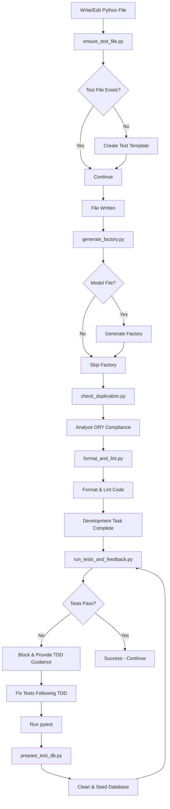

### 🧪 Test-Driven Development (TDD) - MANDATORY
- **Red-Green-Refactor**: Write failing test → Make it pass → Refactor. NO EXCEPTIONS.
- **Test First, Always**: Every feature, every bug fix, every refactor starts with a test.
- **Chicago School TDD**: Test behavior, not implementation
  - Focus on public APIs and outcomes
  - Use real objects when possible, mock only external dependencies
- **London School TDD**: Isolate units with mocks/stubs
  - Test interactions between objects
  - Mock all dependencies for true isolation
- **Coverage Requirements**: Minimum 80%, target 95%
- **Every task iteration MUST have tests** before implementation

### 🔌 MCP Server Integration - MANDATORY
- **Memory Bank MCP**: Maintain cross-session project context and progress tracking
  - Use `mcp__memory-bank__read_memory_bank_file` to access: product-context, active-context, progress, decision-log, system-patterns
  - Use `mcp__memory-bank__track_progress` after completing significant work
  - Use `mcp__memory-bank__update_active_context` to sync tasks and next steps
  - Use `mcp__memory-bank__log_decision` for architectural and design choices
- **Knowledge Graph MCP**: Build persistent knowledge repositories for complex projects
  - Use `mcp__knowledge-graph__create_entities` to capture key concepts, components, and relationships
  - Use `mcp__knowledge-graph__search_nodes` to find relevant information across sessions
  - Use `mcp__knowledge-graph__add_observations` to update understanding over time
- **Playwright MCP**: Automate web interactions and testing
  - Use `mcp__playwright__browser_navigate` + `mcp__playwright__browser_snapshot` for web testing
  - Use `mcp__playwright__browser_click` + `mcp__playwright__browser_type` for form automation
  - Always take snapshots before interactions to understand page state
- **Perplexity MCP**: Access real-time information and research
  - Use `mcp__perplexity-ask__perplexity_ask` for current events, latest documentation, and research
  - Particularly valuable for checking latest framework versions and API changes
- **IDE MCP**: Enhance code analysis and execution
  - Use `mcp__ide__getDiagnostics` to identify code issues before running tests
  - Use `mcp__ide__executeCode` for Jupyter notebook interactions and data analysis
- **Grep MCP**: Search millions of GitHub repositories for code patterns and implementations
  - Use for discovering existing solutions before creating new code (supports LEVER framework)
  - Search with language/file filters: `{"query": "langgraph agent", "language": ["Python"], "path": ["src/"]}`
  - Find optimization patterns: `{"query": "performance optimization", "language": ["TypeScript", "Python"]}`
  - Research testing patterns: `{"query": "pytest fixtures", "language": ["Python"], "path": ["tests/"]}`
  - Validate architecture approaches against real-world implementations
  - Essential for Pattern Recognition Phase and Three-Pass Discovery approach

### 🪝 Claude Code Hooks System - AUTOMATED DEVELOPMENT WORKFLOW
- **Intelligent Automation**: Claude Code Hooks provide automated development workflow enforcement
  - **TDD Enforcement**: Automatically create test files when writing new code
  - **Database Management**: Clean and seed test databases before each test run
  - **Code Quality**: Real-time formatting, linting, and duplication detection
  - **Factory Generation**: Automatic Factory Boy factory creation for models
  - **Continuous Testing**: Automated test execution with TDD guidance

#### 🔧 Implemented Hooks Configuration
The following hooks are configured in `.claude/settings.local.json`:

**1. Test File Enforcement Hook** (`ensure_test_file.py`)
- **Type**: PreToolUse (Write/Edit on *.py files)
- **Purpose**: Enforces TDD by automatically creating test files when writing new Python modules
- **Features**:
  - Generates comprehensive test templates with TDD phases marked
  - Includes unit, integration, and property-based test structures
  - Supports HSA-specific test scenarios and factory patterns
  - Provides clear Red-Green-Refactor guidance

**2. Database Preparation Hook** (`prepare_test_db.py`)
- **Type**: PreToolUse (Bash commands containing "pytest")
- **Purpose**: Ensures clean test database state before running tests
- **Features**:
  - Clears existing test SQLite database
  - Recreates schema from models or SQL files
  - Pre-populates with Factory Boy test data
  - Supports multiple factory loading strategies

**3. Continuous Testing Hook** (`run_tests_and_feedback.py`)
- **Type**: Stop (after development tasks)
- **Purpose**: Automatically runs tests and provides TDD feedback
- **Features**:
  - Executes pytest with coverage analysis
  - Provides detailed test failure analysis
  - Blocks completion on test failures (Red phase)
  - Guides through Red-Green-Refactor cycle
  - Shows coverage gaps and improvement suggestions

**4. Factory Generation Hook** (`generate_factory.py`)
- **Type**: PostToolUse (Write/Edit on *.py files with models)
- **Purpose**: Automatically generates Factory Boy factories for SQLAlchemy/Pydantic models
- **Features**:
  - Detects model files using AST parsing
  - Generates comprehensive factory definitions
  - Includes HSA-specific traits and scenarios
  - Creates builder patterns for complex test data
  - Updates conftest.py with new factories

**5. Duplication Detection Hook** (`check_duplication.py`)
- **Type**: PostToolUse (Write/Edit on *.py files)
- **Purpose**: Real-time code duplication analysis for DRY compliance
- **Features**:
  - Analyzes code blocks for similarity patterns
  - Calculates DRY score (0-100) with severity levels
  - Provides refactoring suggestions
  - Identifies cross-file and same-file duplications
  - Blocks critical violations while allowing minor issues

**6. Format and Lint Hook** (`format_and_lint.py`)
- **Type**: PostToolUse (Write/Edit on *.py files)
- **Purpose**: Automated code formatting and intelligent linting
- **Features**:
  - Supports ruff, black, autopep8 for formatting
  - Uses ruff, flake8, pycodestyle for linting
  - Categorizes issues by severity (critical/warning/style)
  - Focuses on actionable feedback
  - Automatically applies formatting changes

#### 🔄 Hook Workflow Integration
The hooks work together to create an automated TDD and quality workflow:



#### 🎯 Hook Usage Examples

**Automatic Test File Creation:**
```python
# When creating src/user_repository.py
# → Hook automatically creates tests/test_user_repository.py with:
#   - TDD-marked test methods (@pytest.mark.skip)
#   - Factory Boy integration
#   - Setup/teardown methods
#   - Comprehensive test structure
```

**Database Preparation:**
```bash
# Running: pytest tests/test_user_repository.py
# → Hook automatically:
#   1. Clears tests/test_data.db
#   2. Recreates schema from models
#   3. Populates with UserFactory test data
#   4. Ensures clean test environment
```

**Continuous Testing Feedback:**
```python
# After implementing a feature
# → Hook runs pytest and provides:
"""
🧪 AUTOMATED TEST RESULTS
=====================================
Tests: 5 passed, 2 failed, 7 total
Coverage: 85% ✅

🔴 RED PHASE DETECTED: Tests are failing as expected in TDD
📝 Next: Implement minimal code to make these tests pass
✅ Goal: Move to GREEN phase where all tests pass

🚨 CRITICAL ISSUES TO ADDRESS:
  • 2 test(s) are failing
  • Failed test: test_calculate_hsa_limit
  • Error: AssertionError: Expected 4300.0, got None

📋 NEXT STEPS:
  1. Review the failing test assertions
  2. Implement the minimum code needed to pass tests
  3. Run tests again to verify fixes
"""
```

**Real-time DRY Analysis:**
```python
# After editing code with duplications
# → Hook provides:
"""
⚠️ DRY COMPLIANCE CHECK: src/hsa_calculator.py
=============================================
DRY Score: 72/100 ⚠️

📊 Duplications found: 3 total
   🚨 High severity: 1
   ⚠️ Medium severity: 2

🚨 HIGH SEVERITY DUPLICATIONS:
   1. Similarity: 89.2%
      📁 src/hsa_calculator.py:45-52 (8 lines)
      📁 src/contribution_validator.py:23-30 (8 lines)
      💡 Extract common logic into a shared utility function

🔧 REFACTORING RECOMMENDATIONS:
   1. Address 1 high-severity duplications immediately
   2. Extract common functions and classes to shared utilities
   3. Consider creating base classes or mixins for shared behavior
"""
```

#### 🛠️ Hook Utilities and Templates
The hooks leverage shared utilities in `.claude/hooks/utils/`:

- **file_utils.py**: Path manipulation, Python file detection, use-case directory management
- **test_utils.py**: Pytest execution, result parsing, coverage analysis, database management
- **factory_generator.py**: AST-based model parsing, Factory Boy factory generation
- **duplication_detector.py**: Code similarity analysis, DRY scoring, refactoring suggestions

Template files in `.claude/hooks/templates/`:
- **test_template.py**: Comprehensive TDD test template with phases, fixtures, and HSA scenarios
- **factory_template.py**: Factory Boy template with traits, builders, and usage examples

#### 🎛️ Hook Configuration Management
Hooks are configured in `.claude/settings.local.json` with:
- **Event Matchers**: PreToolUse, PostToolUse, Stop events
- **File Filters**: Python file patterns, directory restrictions
- **Tool Filters**: Write, Edit, Bash command patterns
- **Graceful Error Handling**: Never block operations on hook failures

The hooks system integrates seamlessly with the existing MCP workflow and multi-agent development to provide a comprehensive automated development experience.

### 🤖 Multi-Agent Batchtool Development - ENHANCED WORKFLOW
- **Five-Agent Architecture**: Leverage Claude Code's batchtool mode for parallel development with specialized agents
  - **🔨 Coding Agent**: Senior engineer focused on TDD implementation and DRY principles
  - **🧪 Testing Agent**: QA specialist creating comprehensive test suites and mock data
  - **🔍 Code Review Agent**: Tech lead ensuring quality, patterns, and standards
  - **🐛 Debugging Agent**: Performance engineer optimizing and fixing issues
  - **🔒 Security Review Agent**: Advanced threat intelligence analyst leveraging Perplexity MCP for real-time CVE research, zero-day exploit defense, and automated security implementation
- **Parallel Execution Benefits**:
  - 5x faster development through concurrent work
  - Specialized expertise in each domain
  - Comprehensive validation from multiple perspectives
  - Reduced context switching and improved focus
  - Cross-agent validation for higher quality
- **Batchtool Commands**:
  ```bash
  # Full multi-agent execution
  claude code batchtool --prp-file="$PRP_FILE" --mode="multi-agent" \
    --agents="code,test,review,debug,security" \
    --coordination="synchronized"
  
  # Focused agent subset
  claude code batchtool --task="implement-feature" \
    --agents="code,test" --sync-points="after-each-component"
  
  # Audit mode with review agents
  claude code batchtool --mode="audit" \
    --agents="debug,security,review"
  ```
- **Coordination Workflow**:
  - **Phase 1**: All agents analyze PRP and create specialized task lists
  - **Phase 2**: Component cycles with TDD flow (Test→Code→Review→Debug→Security)
  - **Phase 3**: Integration with cross-agent validation
  - **Sync Points**: After components, before integration, on conflicts
- **Quality Gates**: Each component requires sign-off from all 5 agents
- **MCP Integration**: Each agent maintains separate contexts, synchronized at checkpoints
- **Best Practices**:
  - Clear agent boundaries and responsibilities
  - Frequent synchronization to prevent divergence
  - Structured inter-agent communication
  - Consolidated reporting and metrics
  - Conflict resolution through Review Agent arbitration

### 🛡️ Security Intelligence Features - ENHANCED CAPABILITIES
- **Real-Time Threat Research**: Security Agent uses Perplexity MCP to continuously research:
  - Latest CVEs and zero-day exploits (updated hourly)
  - Emerging attack patterns and techniques
  - Security patches and mitigation strategies
  - Industry-specific threat intelligence
- **Automated CVE Defense**:
  - Query CVE databases for technology stack vulnerabilities
  - Generate patches based on latest security advisories
  - Implement defensive code patterns proactively
  - Validate against CVSS scores and exploit availability
- **Zero-Day Protection**:
  - Monitor security communities for emerging threats
  - Implement defense-in-depth strategies
  - Create adaptive security rules based on attack trends
  - Deploy runtime protection mechanisms
- **Security Pattern Learning**:
  - Use Grep MCP to find secure implementations in production code
  - Learn from OWASP and security-focused repositories
  - Extract patterns from recent breach analyses
  - Apply industry best practices automatically
- **Compliance Automation**:
  - OWASP Top 10 2024 validation
  - CWE/SANS Top 25 checking
  - Framework-specific security guidelines
  - Industry compliance (GDPR, SOC2, HIPAA)
- **Threat Intelligence Integration**:
  ```python
  # Example: Real-time CVE checking
  threat_intel = mcp__perplexity-ask__perplexity_ask([{
      "role": "user",
      "content": "Critical CVEs for Django 4.2 in last 30 days with exploits"
  }])
  
  # Apply automated fixes
  security_agent.patch_vulnerabilities(threat_intel)
  ```
- **Security Scoring System**:
  - CVE coverage (real-time validation)
  - Zero-day defense readiness
  - Authentication security level
  - Data protection measures
  - Dependency vulnerability status
  - Configuration security audit
- **Emergency Response**:
  - Immediate action on critical CVEs
  - Automated patch generation and testing
  - Cross-agent security alerts
  - Rollback mechanisms for failed patches

### 🔄 Project Awareness & Context
- **Always read `PLANNING.md`** at the start to understand architecture and constraints.
- **Check `TASK.md`** before starting any work. Add tasks with dependencies and test requirements.
- **Use Memory Bank MCP** to maintain context across sessions - read active-context at start, update progress at end.
- **Use venv_linux** for all Python commands.

### 📁 Use-Case Project Location - MANDATORY
- **ALL use-case projects MUST be created within `/workspaces/hackathon_demo/use-case`** folder.
- **NEVER create project files outside this directory** - this includes:
  - Source code (`src/`, `backend/`, `frontend/`)
  - Test files (`tests/`, `test/`, `__tests__/`)
  - Configuration files (`package.json`, `requirements.txt`, etc.)
  - Documentation (`README.md`, `docs/`)
  - Build artifacts (`dist/`, `build/`, `.next/`)
  - Examples and demos (`examples/`, `demo/`)
  - Any other project-related files or folders
- **Full project tree structure** must be contained within `/workspaces/hackathon_demo/use-case`
- **Absolute path enforcement**: Always use the full path when creating directories or files

### 🧹 Preventing Context Rot
- **MCP-Enhanced Context Management**: 
  - **Session Start**: Read Memory Bank active-context, check Knowledge Graph for relevant entities
  - **During Work**: Update Memory Bank progress, create Knowledge Graph entities for new concepts
  - **Session End**: Update Memory Bank with next steps, log key decisions
- **Frequent State Checks**: Re-read key files periodically, verify before editing, use git status/diff
- **Explicit Documentation**: Update PLANNING.md/TASK.md immediately, add inline comments for decisions
- **Modular Context**: Keep files focused, maintain structure diagram, use full paths in docs
- **Verification Pattern**: Read → Understand → Plan → Execute → Verify → Test → Document → Update MCP
- **Session Boundaries**: Start with PLANNING/TASK review, end with summary, never assume old context
- **Search Before Assuming**: Use grep/search tools for local code, Grep MCP for external patterns, cross-reference dependencies, verify imports exist

### 🧱 Code Structure & Modularity
- **500 line limit per file** - refactor if approaching.
- **Module organization** by feature:
  - `agent.py` - Main logic
  - `tools.py` - Tool functions
  - `prompts.py` - System prompts
- **Use relative imports** within packages.
- **Use python_dotenv** for environment variables.

### 🔄 DRY Principles - MANDATORY
- **Pattern Recognition First**: Before writing any code, search for existing patterns using local tools and Grep MCP
- **Code Reuse Over Creation**: Extend existing functions/classes instead of creating duplicates
- **Single Source of Truth**: Centralize configurations, constants, and repeated logic
- **Shared Utilities**: Create common utility modules for repeated functionality
- **Documentation DRY**: Reference existing documentation instead of duplicating content
- **Test Pattern Reuse**: Use shared test utilities, fixtures, and factory patterns
- **DRY Validation Workflow**:
  - **Before coding**: Search existing codebase for similar patterns using `{"query": "[functionality] implementation", "language": ["Python"]}`
  - **During development**: Extract common functionality into utilities
  - **After implementation**: Refactor duplicated code into shared modules
  - **Code review**: Validate no unnecessary duplication exists
- **Anti-Duplication Patterns**:
  - Extract repeated logic into functions
  - Use inheritance for shared behavior
  - Create mixins for cross-cutting concerns
  - Implement factory patterns for object creation
  - Use decorators for repeated functionality

### 🚀 Code Optimization
- **Refer to `docs/optimization-principles.md`** for LEVER framework and optimization strategies
- **Before creating new code**: Check if existing code can be extended (>50% reduction target)
- **Three-Pass Approach**: Discovery → Design → Implementation
- **Extend don't create**: Add fields to existing tables, enhance queries, reuse components
- **Apply scoring system**: Use extend vs create decision matrix before implementation

### 🎨 Frontend Design & Architecture
- **Refer to `docs/front-end-optimization-principles.md`** for comprehensive frontend guidelines
- **Core principles**: 4 font sizes, 2 weights, 8pt grid, 60/30/10 color rule
- **Modern stack**: shadcn/ui, Tailwind v4, Radix UI, variable fonts (Inter/Geist)
- **Performance targets**: LCP < 2.5s, INP < 200ms, CLS < 0.1
- **Accessibility first**: WCAG 2.2 compliance, keyboard navigation, screen reader support

### ✅ Testing & Quality
- **MCP-Enhanced Testing Workflow**:
  - Use `mcp__ide__getDiagnostics` before writing tests to identify potential issues
  - Use `mcp__playwright__browser_snapshot` for visual regression testing of web components
  - Use `mcp__perplexity-ask__perplexity_ask` to research latest testing best practices
- **Test structure mirrors app structure** in `/tests`.
- **Minimum test coverage**:
  - Happy path test
  - Edge case test
  - Failure case test
  - Property-based tests for complex logic
- **Parameterized tests** for similar cases.
- **Run tests before every commit**.

### 🗄️ Mock Data & Database Testing - MANDATORY
- **Database First**: Setup SQLite database and schema BEFORE writing any code
  - Use SQLite for development (`dev.db`) and in-memory (`:memory:`) for tests
  - Implement Alembic or similar for migration management
  - Create database models with SQLAlchemy or equivalent ORM
- **Mock Data Factory Pattern**: Use Factory Boy (Python) or equivalent
  - Create factories for ALL data models with realistic fake data (Faker library)
  - Implement scenario-based factories (new user, edge cases, error states)
  - Use deterministic seeds for reproducible test runs
- **Test Data Management**:
  - Repository pattern for clean data access abstraction
  - Transactional test fixtures with automatic rollback/cleanup
  - Separate fixture files for different test scenarios
  - Performance test datasets (1000+ records) for load testing
- **Data Compliance**: NO real PII in test data - use realistic but fake data only
- **Reference Guidelines**: See PRPs/templates/prp_base.md and .claude/commands/ for detailed patterns

### 🔒 Security & Error Handling
- **Never commit secrets** - use environment variables.
- **Validate all inputs** at boundaries.
- **Structured logging** with appropriate levels.
- **Never silence exceptions** without logging.
- **Handling .env files** Never edit or change the .env files yourself. Always prompt the user if you need to access .env files under very special circumstances, such as, when you need the secrets, api keys or passwords to create and test use cases, and even in this case, you are only permitted to read .env files, never edit or change. If you need to add additional secrets, pause, and prompt the user to add those for you before continuing. 

### 📎 Style & Conventions
- **Python with PEP8**, type hints, format with `black`.
- **Pydantic** for validation, **FastAPI** for APIs.
- **Google-style docstrings**:
  ```python
  def example(param: str) -> bool:
      """Brief summary.
      
      Args:
          param: Description.
          
      Returns:
          Description.
      """
  ```

### 🚀 Git & Deployment
- **Feature branches** with descriptive names.
- **Conventional commits**: `feat:`, `fix:`, `docs:`, etc.
- **No commits without passing tests**.
- **Update README.md** for new features or setup changes.

### 🧠 AI Behavior Rules
- **MCP-First Approach**: Always consider which MCP tools can enhance the current task
- **Ask questions** when context is missing.
- **Verify existence** of files/modules before use.
- **Never delete code** unless instructed or in TASK.md.
- **Comment complex logic** with `# Reason:` explanations.

#### 🤝 Multi-Agent Coordination Rules
- **Agent Boundaries**: Each agent must stay within its designated domain and expertise
- **Communication Protocol**: Use structured messages for inter-agent communication:
  ```json
  {
    "from_agent": "source",
    "to_agent": "target",
    "type": "request|response|update",
    "component": "affected_component",
    "message": "content",
    "priority": "high|medium|low"
  }
  ```
- **Synchronization Requirements**:
  - Mandatory sync after each component completion
  - Required sync before integration phases
  - Immediate sync on conflict detection
  - Regular checkpoint syncs every 30 minutes
- **Conflict Resolution Protocol**:
  1. **Detection**: Any agent can raise a conflict flag
  2. **Arbitration**: Review Agent leads resolution
  3. **Priority Order**: Security > Functionality > Performance > Quality > Style
  4. **Resolution**: Apply agreed fix and re-validate
  5. **Documentation**: Log all conflicts and resolutions
- **Quality Standards**: No component proceeds without all 5 agents' approval
- **Parallel Work Rules**:
  - Agents work on different components simultaneously
  - Shared utilities require lock/coordination
  - Database schema changes require all-agent sync
  - Configuration changes broadcast to all agents
- **Failure Handling**:
  - If an agent fails, redistribute critical tasks
  - Maintain agent health checks every 5 minutes
  - Automatic recovery attempts before escalation
  - Fallback to reduced agent set if necessary

### 💡 MCP Usage Examples & Best Practices

#### Memory Bank Workflow:
```
Session Start: mcp__memory-bank__read_memory_bank_file("active-context")
During Work: mcp__memory-bank__track_progress("Implemented user auth", "Added JWT validation and middleware")
Session End: mcp__memory-bank__update_active_context(tasks=["Fix auth tests"], nextSteps=["Add password reset"])
```

#### Knowledge Graph for Architecture:
```
New Feature: mcp__knowledge-graph__create_entities([{name: "UserService", entityType: "service", observations: ["Handles authentication", "Uses JWT tokens"]}])
Research: mcp__knowledge-graph__search_nodes("authentication")
Update: mcp__knowledge-graph__add_observations([{entityName: "UserService", contents: ["Added password hashing with bcrypt"]}])
```

#### Playwright for E2E Testing:
```
Test Setup: mcp__playwright__browser_navigate("http://localhost:3000/login")
Visual Check: mcp__playwright__browser_snapshot()
Interaction: mcp__playwright__browser_type("login form email field", ref="...", text="test@example.com")
Validation: mcp__playwright__browser_click("submit button", ref="...")
```

#### Perplexity for Research:
```
Framework Updates: mcp__perplexity-ask__perplexity_ask([{role: "user", content: "Latest Next.js 15 breaking changes and migration guide"}])
Best Practices: mcp__perplexity-ask__perplexity_ask([{role: "user", content: "React 19 concurrent features best practices 2024"}])
```

#### IDE Integration:
```
Code Health: mcp__ide__getDiagnostics() # Before implementing features
Jupyter Work: mcp__ide__executeCode("import pandas as pd; df.head()") # For data analysis tasks
```

#### Multi-Agent Batchtool Workflows:

**1. Full PRP Implementation with 5 Agents:**
```bash
# Launch complete multi-agent development
export PRP_FILE="/workspaces/hackathon_demo/PRPs/hsa-calculator.md"
claude code batchtool --prp-file="$PRP_FILE" \
  --mode="multi-agent" \
  --agents="code,test,review,debug,security" \
  --coordination="synchronized" \
  --output-dir="/workspaces/hackathon_demo/use-case"

# Monitor agent progress
claude code batchtool --status --agents="all"
```

**2. Component-Level Multi-Agent Development:**
```python
# Testing Agent creates test structure
test_agent_context = {
    "component": "user_repository",
    "tasks": ["create_test_file", "write_unit_tests", "setup_fixtures"],
    "mcp_context": mcp__memory-bank__read_memory_bank_file("agent-test-context")
}

# Coding Agent implements to pass tests
code_agent_context = {
    "component": "user_repository", 
    "tasks": ["implement_repository", "add_error_handling", "optimize_queries"],
    "depends_on": test_agent_context["outputs"]
}

# Synchronize after component
sync_results = synchronize_agents(["test", "code", "review", "debug", "security"])
```

**3. Parallel Pattern Discovery:**
```bash
# All agents analyze patterns simultaneously
claude code batchtool --task="pattern-analysis" \
  --target="existing-codebase" \
  --agents="all" \
  --output="pattern-report.json"

# Results:
# - Coding Agent: Found 15 reusable patterns
# - Testing Agent: Identified 8 test patterns
# - Review Agent: Discovered 12 quality standards
# - Debug Agent: Found 5 performance patterns
# - Security Agent: Identified 10 security patterns
```

**4. Cross-Agent Validation Example:**
```python
# Each agent validates others' work
validation_matrix = {
    "test_validates_code": test_agent.validate(code_agent.outputs),
    "security_validates_code": security_agent.validate(code_agent.outputs),
    "review_validates_all": review_agent.validate_all_agents(),
    "debug_validates_performance": debug_agent.profile(all_components)
}

# Conflict resolution
if validation_conflicts_detected(validation_matrix):
    resolution = review_agent.arbitrate(validation_matrix)
    apply_resolution(resolution)
```

**5. Multi-Agent MCP Context Management:**
```python
# Each agent maintains its own MCP context
for agent in ["code", "test", "review", "debug", "security"]:
    # Read agent-specific context
    context = mcp__memory-bank__read_memory_bank_file(f"agent-{agent}-context")
    
    # Update progress
    mcp__memory-bank__track_progress(
        f"Agent-{agent}", 
        f"Completed: {completed_tasks[agent]}"
    )
    
    # Create knowledge graph entities
    mcp__knowledge-graph__create_entities([{
        "name": f"{agent}_patterns",
        "entityType": "agent-knowledge",
        "observations": discovered_patterns[agent]
    }])
```

**6. Emergency Agent Failover:**
```bash
# If testing agent fails, redistribute work
claude code batchtool --agent-failed="test" \
  --redistribute-to="code,review" \
  --priority-tasks="critical-tests"

# Health check all agents
claude code batchtool --health-check --agents="all"
```

**7. Security-Specific Threat Intelligence Workflows:**
```python
# Real-time CVE research and patching workflow
def security_threat_response_workflow():
    # 1. Research current threats for the technology stack
    threat_research = mcp__perplexity-ask__perplexity_ask([{
        "role": "user",
        "content": """
        Critical security vulnerabilities for:
        - FastAPI 0.104.0
        - SQLAlchemy 2.0
        - Python 3.11
        - PostgreSQL 15
        Include: CVE IDs, CVSS scores, exploits in wild, patches
        """
    }])
    
    # 2. Cross-reference with production patterns
    secure_implementations = mcp__grep__searchGitHub({
        "query": "FastAPI security headers authentication",
        "language": ["Python"],
        "repo": "*/security,OWASP/*"
    })
    
    # 3. Generate and apply security patches
    patches = security_agent.generate_patches(threat_research)
    
    # 4. Validate with other agents
    validation = {
        "test": test_agent.validate_security_patches(patches),
        "code": code_agent.integrate_patches(patches),
        "review": review_agent.security_code_review(patches)
    }
    
    # 5. Update threat intelligence knowledge base
    mcp__knowledge-graph__create_entities([{
        "name": "ThreatResponse_" + datetime.now().strftime("%Y%m%d"),
        "entityType": "security-response",
        "observations": [
            f"Threats addressed: {len(patches)}",
            f"CVEs patched: {extract_cve_list(threat_research)}",
            f"Risk reduction: {calculate_risk_reduction(patches)}"
        ]
    }])
```

**8. Zero-Day Defense Implementation:**
```bash
# Proactive zero-day defense workflow
claude code batchtool --task="zero-day-defense" \
  --security-mode="proactive" \
  --agents="security,code,test"

# Security Agent actions:
# 1. Query latest zero-day exploits
# 2. Analyze attack patterns
# 3. Generate defensive rules
# 4. Implement runtime protections

# Example implementation
security_agent.implement_zero_day_defense({
    "waf_rules": generate_waf_rules(zero_day_patterns),
    "input_validation": enhance_validation(attack_vectors),
    "rate_limiting": adaptive_rate_limits(ddos_patterns),
    "monitoring": security_event_monitors(ioc_patterns)
})
```

**9. Emergency CVE Response Protocol:**
```python
# Critical CVE emergency response
def emergency_cve_response(cve_id, severity):
    if severity == "CRITICAL":
        # 1. Immediate research
        cve_details = mcp__perplexity-ask__perplexity_ask([{
            "role": "user",
            "content": f"CVE-{cve_id} exploit details, patches, workarounds"
        }])
        
        # 2. Pause all development
        claude_code_batchtool("--emergency-pause", "--reason", f"CVE-{cve_id}")
        
        # 3. Security Agent takes lead
        security_response = {
            "patch": security_agent.generate_emergency_patch(cve_details),
            "validation": security_agent.validate_patch_effectiveness(),
            "deployment": security_agent.deploy_with_rollback()
        }
        
        # 4. Cross-agent validation
        all_agents_validate(security_response)
        
        # 5. Resume operations
        claude_code_batchtool("--resume", "--after-security-fix")
```

**10. Continuous Security Monitoring:**
```python
# Automated security monitoring workflow
class ContinuousSecurityMonitor:
    def __init__(self):
        self.monitoring_interval = 3600  # 1 hour
        self.threat_threshold = 7.0  # CVSS score
    
    def monitor_loop(self):
        while True:
            # Check for new threats
            new_threats = mcp__perplexity-ask__perplexity_ask([{
                "role": "user",
                "content": "New CVEs last hour web applications critical"
            }])
            
            # Analyze impact on current codebase
            impact_analysis = self.analyze_threat_impact(new_threats)
            
            # Trigger appropriate response
            if impact_analysis['severity'] >= self.threat_threshold:
                self.trigger_security_workflow(impact_analysis)
            
            # Update knowledge graph
            mcp__knowledge-graph__add_observations([{
                "entityName": "SecurityMonitoring",
                "contents": [f"Scan {datetime.now()}: {impact_analysis}"]
            }])
            
            time.sleep(self.monitoring_interval)
```