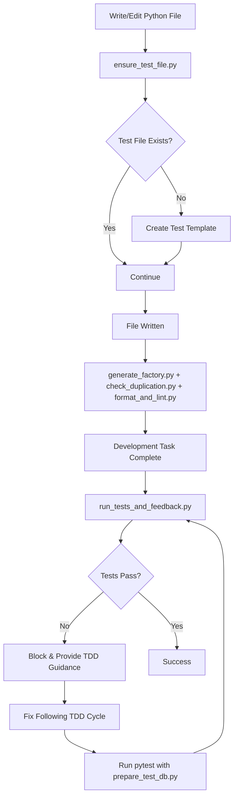

# HSA Contribution Planner - Context Engineering Demo

A comprehensive demonstration of Context Engineering principles applied to building an HSA (Health Savings Account) Contribution Planner using LangGraph multi-agent orchestration, Test-Driven Development, DRY (Don't Repeat Yourself) methodology, MCP (Model Context Protocol) integration, and **Claude Code Hooks** for automated development workflow.

> **This project showcases how Context Engineering with DRY principles, automated hooks, and proper tooling enables AI assistants to build complex, production-ready applications in a single pass.**

## 🎯 Project Overview

The HSA Contribution Planner helps users optimize their Health Savings Account contributions for tax benefits. It features:

- **Three Specialized LangGraph Agents**:
  - `UserInputAgent`: Conversational data collection
  - `LimitCalcAgent`: IRS 2025 limit calculations with catch-up provisions
  - `PlannerAgent`: Per-paycheck contribution recommendations
  
- **IRS Compliance**: Implements 2025 contribution limits ($4,300 self-only / $8,550 family)
- **Smart Calculations**: Handles proration, catch-up contributions (55+), and mid-year changes
- **Conversational UI**: Natural language interface with visual progress indicators

## 🚀 Quick Start

```bash
# 1. Clone the repository
git clone https://github.com/psatyawan-wexinc/hackathon_demo.git
cd hackathon_demo

# 2. Verify MCP setup (required for Claude Code)
# The project includes 4 pre-configured MCP servers:
# - Memory Bank: Cross-session context persistence
# - Knowledge Graph: Architectural knowledge management  
# - Playwright: Web testing automation
# - Perplexity: Real-time documentation research
cat .mcp.json  # View MCP configuration

# 3. Set up Python environment
python -m venv venv_linux
source venv_linux/bin/activate

# 4. Create your feature specification
# Edit PLANNING.md with your requirements (HSA planner already configured)

# 5. Generate a comprehensive PRP (Product Requirements Prompt)
# In Claude Code, run:
/generate-prp PLANNING.md

# 6. Execute the PRP with TDD methodology
# In Claude Code, run:
/execute-prp PRPs/hsa-contribution-planner.md
```

## 📁 Project Structure

```
hackathon_demo/
├── .claude/                      # Claude Code configuration
│   ├── commands/
│   │   ├── generate-prp.md      # Enhanced PRP generation with MCP
│   │   └── execute-prp.md       # TDD execution with validation
│   ├── hooks/                   # Automated development workflow
│   │   ├── ensure_test_file.py  # Auto-generate test files (TDD)
│   │   ├── prepare_test_db.py   # Database seeding automation
│   │   ├── generate_factory.py  # Factory Boy generation
│   │   ├── run_tests_and_feedback.py # Continuous testing
│   │   ├── check_duplication.py # DRY compliance monitoring
│   │   ├── format_and_lint.py   # Code quality enforcement
│   │   ├── utils/               # Shared hook utilities
│   │   └── templates/           # Test and factory templates
│   ├── config.json              # MCP server configurations
│   └── settings.local.json      # Claude Code permissions & hooks
├── .mcp.json                    # MCP server definitions
├── CLAUDE.md                    # Global rules (TDD, MCP, structure)
├── PLANNING.md                  # HSA planner specifications
├── PRPs/                        # Product Requirements Prompts
│   └── templates/
│       └── prp_base.md          # LangGraph HSA template
├── docs/                        # Architecture documentation
├── examples/                    # Reference implementations
├── mcp-integration/             # MCP setup and tools
│   ├── memory-bank/             # Persistent context storage
│   └── scripts/                 # MCP utilities
└── use-case/                    # ⚠️ ALL CODE GOES HERE ⚠️
    ├── src/                     # Implementation code
    ├── tests/                   # Test files (TDD mandatory)
    └── config/                  # Configuration files
```

### ⚠️ Critical Directory Rule

**ALL project code MUST be created within `/workspaces/hackathon_demo/use-case/`**

This includes:
- Source code (`src/`)
- Test files (`tests/`)
- Configuration files
- Documentation
- Any project-related files

## 🔄 Development Workflow

### 1. Understand the Rules (CLAUDE.md)

The project enforces strict guidelines with **automated enforcement** via Claude Code Hooks:

- **Test-Driven Development**: Write tests first, always (auto-enforced)
- **DRY Principles**: Don't Repeat Yourself - comprehensive code reuse strategy (monitored)
- **MCP Integration**: Use Memory Bank and Knowledge Graph throughout
- **Directory Structure**: All code in `/use-case` folder
- **Coverage Requirements**: Minimum 80%, target 95% (auto-validated)
- **Python Environment**: Use `venv_linux` for all commands
- **Automated Quality**: Hooks handle formatting, linting, and TDD enforcement

### 2. Create Feature Specification (PLANNING.md)

The HSA planner specification includes:

```markdown
## FEATURE:
**HSA Contribution Planner Agent Flow**
- UserInputAgent: Collects coverage type, YTD contributions, age, pay periods
- LimitCalcAgent: Applies IRS 2025 limits with catch-up calculations
- PlannerAgent: Generates per-paycheck recommendations

## EXAMPLES:
- examples/planner_flow.json: LangGraph agent orchestration
- examples/ui_mockup.png: Conversational UI design

## DOCUMENTATION:
- IRS resources for 2025 limits
- LangGraph multi-agent patterns
- State management specifications
```

### 3. Generate PRP (Product Requirements Prompt)

The `/generate-prp` command:
1. Loads MCP context (Memory Bank, Knowledge Graph)
2. Researches codebase patterns and documentation
3. Creates comprehensive implementation blueprint
4. Enforces TDD task ordering
5. Validates against all project rules
6. Scores confidence (1-10) for one-pass success

### 4. Execute with TDD Cycle + Automated Hooks

The `/execute-prp` command follows strict TDD with **automated workflow support**:

```
For each component (with hooks automation):
1. Write/Edit File → Hook auto-creates test file → 2. Run pytest → Hook cleans database
3. Implement code → Hook formats/lints → 4. Run tests (GREEN) → Hook validates DRY
5. Refactor → Hook provides feedback → 6. Final validation
```

**Automated Validation** includes:
- **Pre-Write**: Test file generation (ensure_test_file.py)
- **Pre-Test**: Database seeding (prepare_test_db.py)
- **Post-Write**: Factory generation (generate_factory.py)
- **Post-Write**: DRY analysis (check_duplication.py)
- **Post-Write**: Formatting/linting (format_and_lint.py)
- **Stop**: TDD feedback loop (run_tests_and_feedback.py)

## 🔌 MCP Integration

### Memory Bank
- Maintains context across Claude Code sessions
- Tracks progress and decisions
- Updates active context with next steps

```python
# Start of session
mcp__memory-bank__read_memory_bank_file("active-context")

# During work
mcp__memory-bank__track_progress("Implemented UserInputAgent", "All tests passing")

# End of session
mcp__memory-bank__update_active_context(tasks=["..."], nextSteps=["..."])
```

### Knowledge Graph
- Captures architectural decisions
- Links components and relationships
- Enables knowledge queries

```python
mcp__knowledge-graph__create_entities([{
    name: "UserInputAgent",
    entityType: "agent",
    observations: ["Handles conversation flow", "Validates user inputs"]
}])
```

### Additional MCP Tools
- **Playwright**: Automated testing of conversational UI
- **Perplexity**: Latest LangGraph documentation and patterns
- **Grep MCP**: GitHub pattern mining for code reuse discovery
- **IDE**: Code diagnostics before test execution

## 🔄 DRY (Don't Repeat Yourself) Principles

### Core DRY Philosophy

The project implements comprehensive DRY principles to eliminate code duplication and promote pattern reuse:

- **Pattern Recognition First**: Search existing patterns before writing new code
- **Code Reuse Over Creation**: Extend existing functions/classes instead of duplicates
- **Single Source of Truth**: Centralize configurations, constants, and repeated logic
- **Shared Utilities**: Extract common functionality to reusable modules

### DRY Implementation Strategy

#### 1. Pattern Discovery Workflow
```bash
# Before coding, search for existing patterns
rg "[functionality]" src/ --type py
grep -r "pattern_name" src/

# External pattern validation via Grep MCP
{"query": "[feature] implementation", "language": ["Python"], "path": ["src/", "utils/"]}
```

#### 2. Anti-Duplication Architecture
```python
# ✅ DO: Centralized configuration
# config/hsa_limits.py
HSA_LIMITS_2025 = {
    'self_only': 4300,
    'family': 8550,
    'catch_up': 1000
}

# ✅ DO: Shared utility functions
# utils/calculations.py
def calculate_remaining_contribution(ytd: float, annual_limit: float) -> float:
    """DRY: Used by all agents for remaining contribution calculation"""
    return max(0, annual_limit - ytd)

# ✅ DO: Repository pattern inheritance
class BaseRepository(ABC):
    # Common database operations
    
class UserProfileRepository(BaseRepository):
    # Specific user operations extending base
```

#### 3. DRY Validation Gates

The project includes automated DRY compliance checking:

```bash
# Check for code duplication
rg -C 3 "def.*calculate.*contribution" src/
rg "import.*config" src/

# Validate single source of truth
find src/ -name "*.py" -exec grep -l "HSA_LIMIT\|4300\|8550" {} \;
# Should only return config files
```

### DRY Quality Metrics

- **Code reuse ratio**: >70% of functionality extends existing patterns
- **Duplication detection**: <5% duplicate code blocks >3 lines
- **Configuration centralization**: 100% of config values in single source
- **Pattern consistency**: >90% adherence to established patterns

### DRY in Frontend Components

```typescript
// ✅ DO: Compound component pattern
const Form = ({ children, onSubmit }) => (
  <form onSubmit={onSubmit} className="space-y-6">{children}</form>
)

Form.Field = ({ label, error, children }) => (
  <div className="space-y-2">
    <Label>{label}</Label>
    {children}
    {error && <p className="text-destructive">{error}</p>}
  </div>
)

// Usage across multiple forms (DRY)
<Form onSubmit={handleSubmit}>
  <Form.Field label="Email" error={errors.email}>
    <Input {...emailProps} />
  </Form.Field>
</Form>
```

## 🧪 Test-Driven Development + Claude Code Hooks

### The TDD Cycle (Automated)

**Hooks automate the TDD workflow** while maintaining strict Red-Green-Refactor discipline:

1. **Red Phase**: Write failing tests first
   ```python
   def test_user_input_agent_validates_coverage_type():
       agent = UserInputAgent()
       with pytest.raises(ValidationError):
           agent.validate_coverage("invalid")
   ```
   
   🪝 **Hook Integration**: `ensure_test_file.py` auto-generates comprehensive test templates

2. **Green Phase**: Minimal code to pass
   ```python
   def validate_coverage(self, coverage_type: str):
       if coverage_type not in ["self-only", "family"]:
           raise ValidationError("Invalid coverage type")
   ```
   
   🪝 **Hook Integration**: `format_and_lint.py` formats code, `run_tests_and_feedback.py` provides TDD guidance

3. **Refactor Phase**: Improve while keeping tests green

   🪝 **Hook Integration**: `check_duplication.py` monitors DRY compliance and suggests refactoring

### Automated Hook Workflow



### Coverage Requirements (Auto-Enforced)
- Minimum: 80% (enforced by hooks)
- Target: 95% (recommended)
- Focus on: Happy paths, edge cases, error handling
- **Automated feedback**: `run_tests_and_feedback.py` provides detailed coverage analysis

## 🪝 Claude Code Hooks - Automated Development Workflow

### Complete Hook System Overview

The project implements a comprehensive **Claude Code Hooks** system that provides automated development workflow enforcement, ensuring TDD compliance, DRY principles, and code quality without manual intervention.

#### 🔧 Implemented Hooks

**1. Test File Enforcement** (`ensure_test_file.py`)
- **Trigger**: PreToolUse (Write/Edit on *.py files)
- **Purpose**: Enforces TDD by automatically creating test files
- **Features**:
  - Generates comprehensive test templates with TDD phases
  - Includes HSA-specific test scenarios and factory patterns
  - Provides clear Red-Green-Refactor guidance

**2. Database Preparation** (`prepare_test_db.py`)
- **Trigger**: PreToolUse (Bash commands containing "pytest")
- **Purpose**: Ensures clean test database state
- **Features**:
  - Clears existing test SQLite database
  - Recreates schema from models
  - Pre-populates with Factory Boy test data

**3. Continuous Testing** (`run_tests_and_feedback.py`)
- **Trigger**: Stop (after development tasks)
- **Purpose**: Automatically runs tests and provides TDD feedback
- **Features**:
  - Executes pytest with coverage analysis
  - Provides detailed test failure analysis
  - Blocks completion on test failures (Red phase)
  - Guides through Red-Green-Refactor cycle

**4. Factory Generation** (`generate_factory.py`)
- **Trigger**: PostToolUse (Write/Edit on *.py files with models)
- **Purpose**: Automatically generates Factory Boy factories
- **Features**:
  - Detects model files using AST parsing
  - Generates comprehensive factory definitions
  - Includes HSA-specific traits and scenarios

**5. DRY Compliance Monitoring** (`check_duplication.py`)
- **Trigger**: PostToolUse (Write/Edit on *.py files)
- **Purpose**: Real-time code duplication analysis
- **Features**:
  - Analyzes code blocks for similarity patterns
  - Calculates DRY score (0-100) with severity levels
  - Provides refactoring suggestions

**6. Code Quality Enforcement** (`format_and_lint.py`)
- **Trigger**: PostToolUse (Write/Edit on *.py files)
- **Purpose**: Automated code formatting and intelligent linting
- **Features**:
  - Supports ruff, black, autopep8 for formatting
  - Uses ruff, flake8, pycodestyle for linting
  - Categorizes issues by severity

### Hook Configuration

The hooks are configured in `.claude/settings.local.json`:

```json
{
  "hooks": {
    "PreToolUse": [
      {
        "matcher": "Write|Edit",
        "hooks": [
          {
            "type": "command",
            "command": "python /workspaces/hackathon_demo/.claude/hooks/ensure_test_file.py"
          }
        ]
      },
      {
        "matcher": "Bash",
        "hooks": [
          {
            "type": "command", 
            "command": "python /workspaces/hackathon_demo/.claude/hooks/prepare_test_db.py"
          }
        ]
      }
    ],
    "PostToolUse": [
      {
        "matcher": "Write|Edit",
        "hooks": [
          {
            "type": "command",
            "command": "python /workspaces/hackathon_demo/.claude/hooks/generate_factory.py"
          },
          {
            "type": "command",
            "command": "python /workspaces/hackathon_demo/.claude/hooks/check_duplication.py"
          },
          {
            "type": "command",
            "command": "python /workspaces/hackathon_demo/.claude/hooks/format_and_lint.py"
          }
        ]
      }
    ],
    "Stop": [
      {
        "matcher": "",
        "hooks": [
          {
            "type": "command",
            "command": "python /workspaces/hackathon_demo/.claude/hooks/run_tests_and_feedback.py"
          }
        ]
      }
    ]
  }
}
```

## 📋 Best Practices

### Context Engineering Principles

1. **Comprehensive Context**: Include all documentation, examples, and patterns
2. **DRY-First Development**: Search and reuse before creating new code (automated monitoring)
3. **Validation Gates**: Automated checks at each step including DRY compliance
4. **Self-Correcting**: Error patterns guide fixes and refactoring opportunities
5. **One-Pass Success**: Complete context enables single-pass implementation
6. **Hook-Enhanced Workflow**: Automated TDD enforcement and quality assurance

### PRP Quality Metrics

- **Score 10**: All context included, clear TDD path, comprehensive tests
- **Score 7-9**: Minor gaps but implementable
- **Score <7**: Needs more research before execution

### Common Patterns

1. **DRY Agent Architecture**
   ```python
   # Base agent with shared functionality
   class BaseAgent(ABC):
       def __init__(self, config: HSAConfig):
           self.config = config
           self.validator = HSAValidator()
       
       @abstractmethod
       def process(self, state: ConversationState) -> dict:
           pass
   
   # Specific agents extending base
   class UserInputAgent(BaseAgent):
       def process(self, state: ConversationState) -> dict:
           # Agent-specific logic using shared utilities
           pass
   ```

2. **Agent State Management**
   ```python
   class ConversationState(TypedDict):
       user_profile: dict
       contribution_limits: dict
       current_agent: str
   ```

3. **Shared Utilities Pattern**
   ```python
   # Single source of truth for calculations
   from src.utils.calculations import calculate_remaining_contribution
   from src.config.hsa_limits import HSA_LIMITS_2025
   from src.validators.hsa_validators import validate_coverage_type
   ```

4. **Error Recovery**
   - Path errors: Move files to `/use-case`
   - Test failures: Review expectations
   - Coverage gaps: Add edge case tests
   - DRY violations: Extract duplicated code to utilities

## 🤖 Multi-Agent Batchtool Development - ENHANCED WORKFLOW

### Five-Agent Parallel Architecture

This project now includes an advanced **Multi-Agent Batchtool** system leveraging Claude Code's batchtool mode for parallel development with 5 specialized agents:

#### Agent Definitions:
- **🔨 Coding Agent**: Senior engineer focused on TDD implementation and DRY principles
- **🧪 Testing Agent**: QA specialist creating comprehensive test suites and mock data
- **🔍 Code Review Agent**: Tech lead ensuring quality, patterns, and standards
- **🐛 Debugging Agent**: Performance engineer optimizing and fixing issues
- **🔒 Security Review Agent**: Advanced threat intelligence analyst with real-time CVE research and zero-day exploit defense

#### Enhanced Security Agent Features:
- **Real-Time Threat Intelligence**: Uses Perplexity MCP for hourly CVE updates
- **Zero-Day Defense**: Proactive protection against emerging exploits
- **Automated Patching**: AI-generated patches based on latest security advisories
- **Continuous Monitoring**: 24/7 threat landscape surveillance
- **Pattern Learning**: Learns from production security implementations via Grep MCP

### Multi-Agent Commands:

```bash
# Full multi-agent execution
claude code batchtool --prp-file="$PRP_FILE" --mode="multi-agent" \
  --agents="code,test,review,debug,security" \
  --coordination="synchronized"

# Security-focused audit
claude code batchtool --mode="security-audit" \
  --agents="security,review,debug" \
  --threat-intel="enabled"

# Emergency CVE response
claude code batchtool --emergency-security \
  --cve="CVE-2024-XXXXX" \
  --severity="critical"
```

### Parallel Execution Benefits:
- **5x Faster Development**: Concurrent work across specialized domains
- **Enhanced Security**: Real-time threat protection with Perplexity research
- **Cross-Agent Validation**: Multiple perspectives ensure higher quality
- **Continuous Learning**: Agents share patterns and improvements
- **Proactive Defense**: Stay ahead of security threats

### Multi-Agent Workflow:
1. **Phase 1**: All agents analyze PRP and create specialized task lists
2. **Phase 2**: Component cycles with TDD flow (Test→Code→Review→Debug→Security)
3. **Phase 3**: Integration with cross-agent validation and threat intelligence
4. **Quality Gates**: Each component requires sign-off from all 5 agents

## 🔗 Resources

### Project Documentation
- [CLAUDE.md](/CLAUDE.md) - Global project rules with multi-agent coordination
- [execute-prp.md](/.claude/commands/execute-prp.md) - Multi-agent execution workflow
- [PLANNING.md](/PLANNING.md) - HSA planner specifications with DRY architecture
- [Optimization Principles](/docs/optimization-principles.md) - LEVER framework with DRY methodology
- [Frontend DRY Guidelines](/docs/front-end-optimization-principles.md) - Component reuse patterns
- [MCP Setup Guide](/mcp-integration/docs/mcp-setup.md)

### External Resources
- [LangGraph Documentation](https://langchain-ai.github.io/langgraph/)
- [IRS Publication 969](https://www.irs.gov/publications/p969) - HSA Rules
- [IRS Rev. Proc. 2024-25](https://www.irs.gov/pub/irs-drop/rp-24-25.pdf) - 2025 Limits
- [Claude Code Documentation](https://docs.anthropic.com/en/docs/claude-code)

### Example Implementations
- `/examples/planner_flow.json` - Agent orchestration patterns
- `/examples/ui_mockup.png` - UI/UX reference design
- `/PRPs/templates/prp_base.md` - LangGraph-specific PRP template

---

## 🎉 Benefits of This Implementation

### Automated Development Workflow
- **Zero Manual Setup**: Hooks automatically create test files, factories, and database setup
- **Real-Time Quality**: Continuous monitoring of DRY compliance and code quality
- **TDD Enforcement**: Impossible to skip tests - workflow blocks until tests pass
- **Intelligent Feedback**: Specific guidance for Red-Green-Refactor cycles

### Production-Ready Standards
- **Complete Test Coverage**: Automated generation ensures comprehensive test suites
- **DRY Compliance**: Real-time duplication detection prevents code bloat
- **Security Integration**: Multi-agent system includes proactive threat intelligence
- **Performance Monitoring**: Built-in optimization and profiling hooks

### Developer Experience
- **Effortless Quality**: All quality checks happen automatically in the background
- **Clear Guidance**: Hooks provide specific, actionable feedback at each step
- **Rapid Iteration**: Automated database seeding and test generation speed up development
- **Learning System**: Hooks learn from patterns and provide increasingly better suggestions

---

*This project demonstrates the power of Context Engineering with Claude Code Hooks and Multi-Agent Batchtool: providing AI assistants with comprehensive context, automated development workflow, parallel specialized agents, real-time threat intelligence, and validation gates to build production-ready applications at unprecedented speed, quality, and security.*